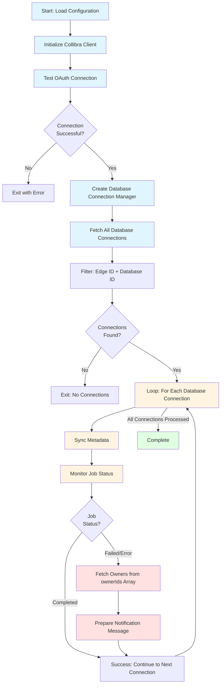

# Collibra Database Metadata Synchronization & Monitoring Tool

An automated tool for testing, synchronizing, and monitoring database metadata synchronization jobs in Collibra. This tool identifies failed database synchronizations, retrieves database owner information, and prepares notification data for alerting owners about synchronization failures.

## Overview

This tool automates the complete workflow of database metadata synchronization in Collibra:

- **Automated Synchronization**: Triggers metadata synchronization jobs for all cataloged database connections
- **Job Monitoring**: Tracks synchronization job status until completion or failure
- **Failure Detection**: Identifies databases with failed synchronizations
- **Owner Identification**: Retrieves database owner information from Collibra's Catalog Database API
- **Notification Preparation**: Formats human-readable notification messages and exports structured JSON data for integration with notification systems (email, Slack, etc.)
- **Comprehensive Reporting**: Provides detailed summary reports with owner information for failed databases

**Built on a clean, production-ready Python client** for Collibra's REST API with:
- **Clean Architecture**: Separation of concerns with modular design
- **Type Safety**: Full type hints for better IDE support and error detection
- **Error Handling**: Comprehensive exception hierarchy for precise error handling
- **Production Ready**: Retry logic, token management, and robust error handling

## Key Features

### Core Functionality
- ✅ **Automated Database Synchronization**: Triggers metadata synchronization for all cataloged database connections
- ✅ **Job Status Monitoring**: Tracks synchronization jobs until completion, failure, or timeout
- ✅ **Failure Detection**: Identifies databases with failed synchronizations and captures error details
- ✅ **Owner Information Retrieval**: Fetches database owners from Catalog Database API (`ownerIds` array)
- ✅ **Multiple Owners Support**: Handles databases with multiple owners gracefully
- ✅ **Notification Preparation**: Formats human-readable notification messages ready for email/Slack
- ✅ **JSON Export**: Exports failed databases with owner information to structured JSON format
- ✅ **Comprehensive Reporting**: Provides detailed summary reports with owner information

### Technical Features
- ✅ **OAuth 2.0 Authentication**: Client credentials flow with automatic token management
- ✅ **Token Lifecycle Management**: Automatic token caching and refresh with expiration buffer
- ✅ **Retry Logic**: Built-in retry strategy for transient failures (429, 5xx errors)
- ✅ **Clean Architecture**: Separation of concerns (auth, client, config, catalog, notifications)
- ✅ **Type Hints**: Full type annotations for better IDE support and type checking
- ✅ **Comprehensive Error Handling**: Custom exception hierarchy with detailed error information
- ✅ **Configuration Management**: Support for environment variables and direct initialization
- ✅ **Test Suite**: Comprehensive pytest test suite with integration and unit tests
- ✅ **Pre-commit Hooks**: Automated code quality checks (linting, formatting, type checking)

## Business Process Flow

The main orchestrator script (`main.py`) follows this complete workflow:



**Key Process Steps (per database connection):**
1. **Authentication**: OAuth connection test and validation
2. **Connection Discovery**: Fetch and filter cataloged database connections
3. **For Each Database Connection**:
   - **Synchronization**: Trigger metadata synchronization job
   - **Monitoring**: Track job status until completion or failure
   - **If Failed**: Fetch all owners from `ownerIds` array (supports multiple owners)
   - **If Failed**: Prepare notification message for the failed database

**Note on "No Job ID" case:** If the synchronization API doesn't return a job ID, the process skips monitoring for that database. This can occur if the sync completes immediately or if the API response format is unexpected. The database is tracked separately (not marked as failed) since its status cannot be determined.

## Installation

This project uses [`uv`](https://github.com/astral-sh/uv) for fast Python package management.

### Prerequisites

Install `uv` (if not already installed):
```bash
# macOS/Linux
curl -LsSf https://astral.sh/uv/install.sh | sh

# Windows (PowerShell)
powershell -ExecutionPolicy ByPass -c "irm https://astral.sh/uv/install.ps1 | iex"

# Or using pip
pip install uv
```

### Setup

```bash
# Install dependencies and create virtual environment
uv sync

# Or install with dev dependencies
uv sync --extra dev
```

> **Note**: Dependencies are managed in `pyproject.toml`. If you need a `requirements.txt` file for compatibility, you can generate it with: `uv pip compile pyproject.toml -o requirements.txt`

## Configuration

1. Copy `.env.example` to `.env`:
   ```bash
   cp .env.example .env
   ```

2. Update `.env` with your Collibra credentials:
   ```bash
   # Edit .env file with your actual credentials
   nano .env  # or use your preferred editor
   ```

   The `.env.example` file contains all required environment variables with documentation:
   - **OAuth Credentials**: Required for REST API v2.0 (get from Settings > OAuth Applications)
   - **Basic Auth Credentials**: Required for Catalog Database Registration API (your Collibra username/password)

   **Required Variables:**
   - `COLLIBRA_BASE_URL` - Your Collibra instance URL
   - `COLLIBRA_CLIENT_ID` - OAuth client ID
   - `COLLIBRA_CLIENT_SECRET` - OAuth client secret
   - `COLLIBRA_BASIC_AUTH_USERNAME` - Username for Basic Auth
   - `COLLIBRA_BASIC_AUTH_PASSWORD` - Password for Basic Auth

## Usage

### Quick Start - Automated Database Synchronization & Monitoring

Run the complete automated workflow to synchronize all database metadata and identify failures:

```bash
python3 main.py
```

**What this does:**
1. ✅ Loads configuration from `.env`
2. ✅ Tests OAuth connection to Collibra
3. ✅ Fetches all cataloged database connections
4. ✅ Triggers metadata synchronization for each database
5. ✅ Monitors job status until completion or failure
6. ✅ Identifies failed synchronizations
7. ✅ Retrieves owner information for failed databases
8. ✅ Formats notification messages for each failure
9. ✅ Provides comprehensive summary report
10. ✅ **Prepares notification data structure** ready for email/Slack integration

**Example Output:**
```
================================================================================
FAILED DATABASES AND THEIR OWNERS
================================================================================

Database: DS_DEMO_DATA
  Database ID: 0197e4de-e599-75c4-8fff-9b0fd56508c9
  Connection ID: f919489f-2942-418c-a282-4473a1d7492a
  Error: Database API request failed: 500 Server Error...
  Owner:
    - Name: Gorik Desmet
    - Email: orik@datashift.eu
    - Owner ID: 474d1818-0822-4570-bd67-8f629730ce61

================================================================================
STEP 8: Preparing notification data
================================================================================

   ✓ Notification data prepared
   ✓ Contains 3 failed database(s) with owner information
   ✓ Data structure ready for notifications (stored in variable)

   Example JSON structure:
   {
     "generated_at": "2024-01-01T12:00:00",
     "total_failed": 3,
     "failed_databases": [...]
   }

💡 Notification data is stored and ready to use.
   Access it via: notification_data variable
```

**Notification Data Structure:**
The script prepares a `notification_data` dictionary variable with the following structure:

```json
{
  "generated_at": "2024-01-01T12:00:00",
  "total_failed": 3,
  "failed_databases": [
    {
      "database": {
        "name": "DS_DEMO_DATA",
        "database_id": "0197e4de-e599-75c4-8fff-9b0fd56508c9",
        "connection_id": "f919489f-2942-418c-a282-4473a1d7492a"
      },
      "error": "Database API request failed: 500 Server Error...",
      "owners": [
        {
          "owner_id": "474d1818-0822-4570-bd67-8f629730ce61",
          "name": "Gorik Desmet",
          "email": "orik@datashift.eu",
          "username": "gorik.desmet"
        }
      ],
      "notification_message": "Hello,\n\nWe wanted to inform you that the metadata synchronization for your database has failed.\n\nDatabase: DS_DEMO_DATA\nDatabase ID: 0197e4de-e599-75c4-8fff-9b0fd56508c9\n..."
    }
  ]
}
```

**Key Features:**
- **Multiple Owners Support**: The `owners` field is an array, as databases can have multiple owners
- **Pre-formatted Messages**: Each failed database includes a `notification_message` field with a human-readable message ready to send
- **Complete Owner Information**: Includes owner ID, name, email, and username for each owner
- **Variable Storage**: Data is stored in `notification_data` variable for programmatic use

**Notification Message Format:**
The `notification_message` field contains a formatted, human-friendly message that:
- Greets the owner(s) professionally
- Explains the synchronization failure
- Provides database details (name, ID, connection ID)
- Includes error details
- Lists all owners (if multiple)
- Provides action items and contact information

**Usage:**
The `notification_data` variable can be used directly in your code for sending notifications:

```python
# After running main.py, notification_data is available
if notification_data and notification_data['total_failed'] > 0:
    for failed_db in notification_data['failed_databases']:
        # Send notification to each owner
        for owner in failed_db['owners']:
            send_email(
                to=owner['email'],
                subject=f"Database Sync Failed: {failed_db['database']['name']}",
                body=failed_db['notification_message']
            )
```

Or serialize to JSON if needed:
```python
import json
json_output = json.dumps(notification_data, indent=2)
```

### Programmatic Usage

If you need to integrate this functionality into your own scripts:

```python
from collibra_client import CollibraClient, CollibraConfig, DatabaseConnectionManager

# Load configuration from environment variables
config = CollibraConfig.from_env()

# Create client
client = CollibraClient(
    base_url=config.base_url,
    client_id=config.client_id,
    client_secret=config.client_secret,
)

# Create database connection manager
db_manager = DatabaseConnectionManager(client=client, use_oauth=True)

# List all database connections
connections = db_manager.list_database_connections()

# Synchronize metadata for a specific database
sync_result = db_manager.synchronize_database_metadata(connections[0].database_id)

# Monitor job status
job_status = client.get_job_status(sync_result["jobId"])
```

### Testing

**Important**: All tests use **real credentials** from your `.env` file. There are no mock tests.

This project uses **pytest** for all testing. Tests are located in the `tests/` directory.

#### Test Setup

Before running tests, ensure you have:
1. Created `.env` file from `.env.example` with your credentials
2. Installed dev dependencies: `uv sync --extra dev`

#### Running Tests

**Run all tests:**
```bash
uv run pytest
```

**Run integration tests only:**
```bash
uv run pytest -m integration -v
```

**Run without coverage (faster, avoids INTERNALERROR):**
```bash
uv run pytest -m integration -v --no-cov
```

**Run specific test file:**
```bash
uv run pytest tests/test_connection.py -v
uv run pytest tests/test_database_connections.py -v
```

**Run specific test:**
```bash
uv run pytest tests/test_connection.py::TestConnection::test_connection_success -v
```

**Run with coverage:**
```bash
uv run pytest --cov=collibra_client --cov-report=term-missing --cov-report=html
```

Coverage reports are generated in `htmlcov/` directory.

#### Test Structure

Tests are organized in the `tests/` directory:
- `conftest.py` - Shared pytest fixtures and configuration
- `test_config.py` - Configuration management tests
- `test_connection.py` - OAuth connection and authentication tests
- `test_database_connections.py` - Database connection management tests

All integration tests are marked with `@pytest.mark.integration` decorator.

#### Rate Limiting

Tests are designed to handle Collibra API rate limits gracefully. If tests hit rate limits (429 errors), they will be **skipped** instead of failing. This prevents false negatives in CI/CD pipelines.

**To avoid rate limits:**
- Run tests individually: `pytest tests/test_connection.py::TestConnection::test_connection_success -v`
- Wait between test runs
- Use session-scoped fixtures (already implemented) to reuse tokens across tests

#### Quick Utility Scripts

For manual testing and quick checks, use the utility scripts in `scripts/` directory:

**Quick OAuth connection test:**
```bash
python3 scripts/test_connection_simple.py
```
This will:
- ✅ Load configuration from `.env`
- ✅ Test OAuth authentication
- ✅ Fetch current user information
- ✅ Verify connection is working

**Database connection testing:**
```bash
python3 scripts/test_database_connections.py
```
This uses OAuth Bearer token authentication (no Basic Auth credentials needed).

**Fetch owners for failing databases:**
```bash
python3 scripts/test_fetch_failing_database_owners.py
```
This script:
- Synchronizes metadata for each database
- Monitors job status
- Fetches owner information from `ownerIds` array (Catalog Database API)
- Displays detailed owner information for failures

**Other utility scripts:**
- `test_fetch_users.py` - Fetch and display users from Collibra
- `test_database_connections_simple.py` - Simple database connection listing
- `test_synchronize_database.py` - Standalone database synchronization
- `test_job_status.py` - Inspect job status response structure

See `scripts/README.md` for all available utility scripts.

#### Test Requirements

All tests require actual credentials in `.env`:
- `COLLIBRA_BASE_URL` - Required
- `COLLIBRA_CLIENT_ID` - Required
- `COLLIBRA_CLIENT_SECRET` - Required

Basic Auth credentials (`COLLIBRA_BASIC_AUTH_USERNAME`, `COLLIBRA_BASIC_AUTH_PASSWORD`) are optional - the database connection manager uses OAuth Bearer token by default.

#### Test Fixtures

The test suite uses pytest fixtures defined in `conftest.py`:
- **Session-scoped fixtures**: Reuse tokens across tests to minimize API calls
- **Client fixtures**: Pre-configured CollibraClient instances
- **Config fixtures**: Configuration loaded from environment variables

#### Writing New Tests

When writing new tests:
1. Mark integration tests with `@pytest.mark.integration`
2. Use fixtures from `conftest.py` for client and configuration
3. Handle rate limits gracefully (tests will skip on 429 errors)
4. Use session-scoped fixtures when possible to reduce API calls

### Direct Initialization

```python
from collibra_client import CollibraClient

client = CollibraClient(
    base_url="https://your-instance.collibra.com",
    client_id="your_client_id",
    client_secret="your_client_secret",
)
```

### Using Dependency Injection

```python
from collibra_client import CollibraClient, CollibraAuthenticator

# Create authenticator separately
authenticator = CollibraAuthenticator(
    base_url="https://your-instance.collibra.com",
    client_id="your_client_id",
    client_secret="your_client_secret",
)

# Inject into client
client = CollibraClient(
    base_url="https://your-instance.collibra.com",
    client_id="your_client_id",
    client_secret="your_client_secret",
    authenticator=authenticator,
)
```

## API Reference

### CollibraClient Methods

The client provides convenience methods for common HTTP operations:

#### `get(endpoint, params=None, headers=None) -> Dict[str, Any]`
Make a GET request to retrieve resources.

**Parameters:**
- `endpoint` (str): API endpoint path (e.g., "/rest/2.0/users")
- `params` (Optional[Dict[str, Any]]): Query parameters
- `headers` (Optional[Dict[str, str]]): Additional HTTP headers

**Returns:** JSON response as dictionary

**Example:**
```python
users = client.get("/rest/2.0/users", params={"limit": 10})
current_user = client.get("/rest/2.0/users/current")
```

#### `post(endpoint, json_data=None, data=None, params=None, headers=None) -> Dict[str, Any]`
Make a POST request to create resources.

**Parameters:**
- `endpoint` (str): API endpoint path
- `json_data` (Optional[Dict[str, Any]]): JSON body data
- `data` (Optional[Union[Dict[str, Any], str]]): Form-encoded body data
- `params` (Optional[Dict[str, Any]]): Query parameters
- `headers` (Optional[Dict[str, str]]): Additional HTTP headers

**Returns:** JSON response as dictionary

**Example:**
```python
new_asset = client.post(
    "/rest/2.0/assets",
    json_data={"name": "My Asset", "domainId": "domain-uuid"}
)
```

#### `put(endpoint, json_data=None, data=None, params=None, headers=None) -> Dict[str, Any]`
Make a PUT request to update resources.

**Parameters:** Same as `post()`

**Returns:** JSON response as dictionary

**Example:**
```python
updated_asset = client.put(
    "/rest/2.0/assets/asset-uuid",
    json_data={"name": "Updated Name"}
)
```

#### `delete(endpoint, params=None, headers=None) -> Dict[str, Any]`
Make a DELETE request to remove resources.

**Parameters:**
- `endpoint` (str): API endpoint path
- `params` (Optional[Dict[str, Any]]): Query parameters
- `headers` (Optional[Dict[str, str]]): Additional HTTP headers

**Returns:** JSON response as dictionary (empty dict for 204 responses)

**Example:**
```python
result = client.delete("/rest/2.0/assets/asset-uuid")
```

#### `test_connection() -> bool`
Test the connection to Collibra API by making a simple authenticated request.

**Returns:** True if connection is successful

**Raises:** `CollibraAPIError` if connection test fails

**Example:**
```python
if client.test_connection():
    print("Connection successful!")
```

## Error Handling

The client raises specific exceptions:

- `CollibraAuthenticationError` - Authentication failures
- `CollibraAPIError` - API request failures
- `CollibraClientError` - Base exception for all client errors

```python
from collibra_client import (
    CollibraClient,
    CollibraAPIError,
    CollibraAuthenticationError,
)

try:
    client = CollibraClient(...)
    data = client.get("/rest/2.0/assets")
except CollibraAuthenticationError as e:
    print(f"Authentication failed: {e}")
except CollibraAPIError as e:
    print(f"API error: {e.status_code} - {e}")
```

## Database Connection Testing

The library includes functionality to test database connections and notify owners of failures.

### Quick Start

```python
from collibra_client import (
    CollibraClient,
    CollibraConfig,
    DatabaseConnectionManager,
    ConsoleNotificationHandler,
    get_connection_owner,
)

# Note: All imports are available from the main package.
# You can also import directly from scopes if needed:
# from collibra_client.core import CollibraClient, CollibraConfig
# from collibra_client.catalog import DatabaseConnectionManager
# from collibra_client.notifications import ConsoleNotificationHandler

# Load configuration
config = CollibraConfig.from_env()

# Create OAuth client
client = CollibraClient(
    base_url=config.base_url,
    client_id=config.client_id,
    client_secret=config.client_secret,
)

# Create database connection manager (uses OAuth Bearer token by default)
db_manager = DatabaseConnectionManager(
    client=client,
    use_oauth=True,  # Uses OAuth Bearer token (default)
)

# List all database connections
connections = db_manager.list_database_connections()
for conn in connections:
    print(f"Connection: {conn.name} (ID: {conn.id})")

# Test a specific connection
result = db_manager.test_database_connection(connections[0].id)
if not result["success"]:
    # Get owner and notify
    owner = get_connection_owner(client, connections[0])
    handler = ConsoleNotificationHandler()
    handler.notify(connections[0], result["message"], owner)
```

### Running the Test Script

A complete script is provided to test all database connections:

```bash
# Set environment variables
export COLLIBRA_BASE_URL="https://your-instance.collibra.com"
export COLLIBRA_CLIENT_ID="your_client_id"
export COLLIBRA_CLIENT_SECRET="your_client_secret"
export COLLIBRA_BASIC_AUTH_USERNAME="your_username"
export COLLIBRA_BASIC_AUTH_PASSWORD="your_password"

# Run the test script
uv run python test_database_connections.py
```

### Database Connection Manager

The `DatabaseConnectionManager` class provides methods to:

- **`list_database_connections()`** - List all synchronized database connections
- **`refresh_database_connections()`** - Refresh connections from the data source
- **`test_database_connection()`** - Test if a connection is still valid
- **`get_database_connection_by_id()`** - Get a specific connection by ID
- **`get_database_asset()`** - Get database asset details (returns `ownerIds` array)
- **`synchronize_database_metadata()`** - Trigger metadata synchronization job

### Owner Information Retrieval

Database owners are retrieved from the Catalog Database API, which returns `ownerIds` as an array. Cataloged databases always have one or several owners.

**Using `get_connection_owner()`:**
```python
from collibra_client import get_connection_owner

owner = get_connection_owner(client, connection)
if owner:
    print(f"Owner: {owner.get('name')}")
    print(f"Email: {owner.get('email')}")
```

**Direct API access:**
```python
db_asset = db_manager.get_database_asset(database_id)
owner_ids = db_asset.get("ownerIds")  # Array of owner IDs
if owner_ids:
    owner_id = owner_ids[0]  # Use first owner
    user = client.get_user(owner_id)
```

### Notification Handlers

Multiple notification handlers are available:

- **`ConsoleNotificationHandler`** - Prints notifications to console (for testing)
- **`CollibraNotificationHandler`** - Sends notifications via Collibra API
- **`EmailNotificationHandler`** - Sends email notifications (placeholder)

You can also create custom handlers by implementing the `NotificationHandler` interface.

## Architecture

The client follows clean architecture principles and design patterns with a modular, scope-based structure:

### Project Structure

```
collibra_client/
├── __init__.py              # Main package exports
├── core/                    # Core functionality
│   ├── __init__.py
│   ├── auth.py              # OAuth 2.0 authentication
│   ├── client.py             # Main HTTP client
│   ├── config.py             # Configuration management
│   └── exceptions.py         # Exception hierarchy
├── catalog/                  # Catalog/Database API functionality
│   ├── __init__.py
│   └── connections.py       # Database connection management
└── notifications/            # Notification system
    ├── __init__.py
    ├── handlers.py           # Notification handlers
    └── owner.py              # Owner information retrieval
```

### Module Structure by Scope

#### **Core Module** (`collibra_client.core`)
Core functionality shared across all features:
- **`auth.py`** - OAuth 2.0 authentication and token lifecycle management
  - `CollibraAuthenticator`: Handles token acquisition, caching, and refresh
  - `TokenInfo`: Data class representing token metadata
- **`client.py`** - Main API client with HTTP methods
  - `CollibraClient`: High-level interface for API interactions
  - Automatic authentication handling
  - Retry logic for transient failures
- **`config.py`** - Configuration management
  - `CollibraConfig`: Configuration class with environment variable support
  - Validation of required configuration values
  - Support for both OAuth and Basic Auth credentials
- **`exceptions.py`** - Custom exception hierarchy
  - `CollibraClientError`: Base exception
  - `CollibraAuthenticationError`: Authentication failures
  - `CollibraAPIError`: API request failures
  - `CollibraTokenError`: Token operation failures

#### **Catalog Module** (`collibra_client.catalog`)
Catalog Database Registration API functionality:
- **`connections.py`** - Database connection management
  - `DatabaseConnection`: Data class representing a database connection
  - `DatabaseConnectionManager`: Manager for testing and refreshing connections
  - Basic Authentication support for Catalog Database Registration API

#### **Notifications Module** (`collibra_client.notifications`)
Notification system for connection failures:
- **`handlers.py`** - Notification handler implementations
  - `NotificationHandler`: Abstract base class for notification handlers
  - `ConsoleNotificationHandler`: Console-based notifications
  - `CollibraNotificationHandler`: Collibra API-based notifications
  - `EmailNotificationHandler`: Email notification handler (placeholder)
- **`owner.py`** - Owner information utilities
  - `get_connection_owner()`: Utility to retrieve connection owners from Collibra assets

### Design Patterns

1. **Dependency Injection**: Authenticator can be injected into the client for testing
2. **Strategy Pattern**: Retry strategy configurable via HTTPAdapter
3. **Factory Pattern**: `CollibraConfig.from_env()` factory method
4. **Facade Pattern**: `CollibraClient` provides a simple interface to complex operations
5. **Single Responsibility**: Each module has a clear, focused responsibility

## Development

### Pre-commit Hooks

This project uses [pre-commit](https://pre-commit.com/) to ensure code quality and consistency. The hooks automatically run checks before each commit.

**Setup:**
```bash
# Install dependencies (pre-commit is included in dev dependencies)
uv sync --extra dev

# Install the git hook scripts
uv run pre-commit install

# (Optional) Run against all files
uv run pre-commit run --all-files
```

**Hooks Included:**
- **Black**: Code formatting (line length: 100)
- **Ruff**: Fast Python linter (replaces flake8, isort, etc.)
- **MyPy**: Static type checking
- **General Checks**: Trailing whitespace, end-of-file fixer, YAML/JSON/TOML validation
- **Security**: Private key detection

**Manual Run:**
```bash
# Run hooks on staged files only
uv run pre-commit run

# Run specific hook
uv run pre-commit run black --all-files
uv run pre-commit run ruff --all-files
uv run pre-commit run mypy --all-files
```

### Adding Dependencies

```bash
# Using uv (recommended)
uv add package-name
uv add --dev package-name

# Using pip
pip install package-name
```

### Code Quality

```bash
# Format code (if black is installed)
black .

# Lint code (if ruff is installed)
ruff check .

# Type checking (if mypy is installed)
mypy collibra_client
```

## Best Practices & Design Principles

### Code Quality

1. **Type Safety**: All functions include type hints for better IDE support and error detection
2. **Documentation**: Comprehensive docstrings following Google-style conventions
3. **Error Handling**: Specific exception types for different failure scenarios
4. **Separation of Concerns**: Each module has a single, well-defined responsibility
5. **Dependency Injection**: Authenticator injection enables easy testing and customization

### Token Management

- **Automatic Caching**: Tokens are cached to minimize API calls
- **Expiration Buffer**: 60-second buffer prevents race conditions
- **Automatic Refresh**: Tokens are refreshed automatically when expired
- **Error Recovery**: Failed authentication triggers automatic retry with new token

### Error Handling

- **Exception Hierarchy**: Clear exception hierarchy for precise error handling
- **Detailed Errors**: Exceptions include status codes and response bodies when available
- **Graceful Degradation**: Network errors are caught and wrapped appropriately

### Testing

- **pytest Framework**: All tests use pytest and are located in `tests/` directory
- **Unit Tests**: Test configuration and isolated components without external dependencies
- **Integration Tests**: Test full client functionality with real Collibra instance (marked with `@pytest.mark.integration`)
- **Test Fixtures**: Reusable fixtures in `conftest.py` for client and configuration setup
- **Rate Limiting Handling**: Tests automatically skip when hitting API rate limits (429 errors) instead of failing
- **Session-Scoped Fixtures**: Tokens are reused across tests to minimize API calls and avoid rate limits
- **Utility Scripts**: Scripts in `scripts/` directory for quick manual testing (not pytest tests)
- **Coverage**: Run tests with coverage reporting: `uv run pytest --cov=collibra_client`

## Troubleshooting

### Common Issues

**Authentication Failures:**
```python
# Check your credentials
try:
    client.test_connection()
except CollibraAuthenticationError as e:
    print(f"Auth failed: {e.status_code} - {e}")
    # Verify COLLIBRA_CLIENT_ID and COLLIBRA_CLIENT_SECRET
```

**Connection Timeouts:**
```python
# Increase timeout
client = CollibraClient(
    base_url=config.base_url,
    client_id=config.client_id,
    client_secret=config.client_secret,
    timeout=60  # Increase from default 30 seconds
)
```

**Token Refresh Issues:**
```python
# Force token refresh
client._authenticator.invalidate_token()
token = client._authenticator.get_access_token(force_refresh=True)
```

**API Errors:**
```python
try:
    result = client.get("/rest/2.0/invalid-endpoint")
except CollibraAPIError as e:
    print(f"Status: {e.status_code}")
    print(f"Error: {e}")
    print(f"Response: {e.response_body}")
```

## License

MIT

