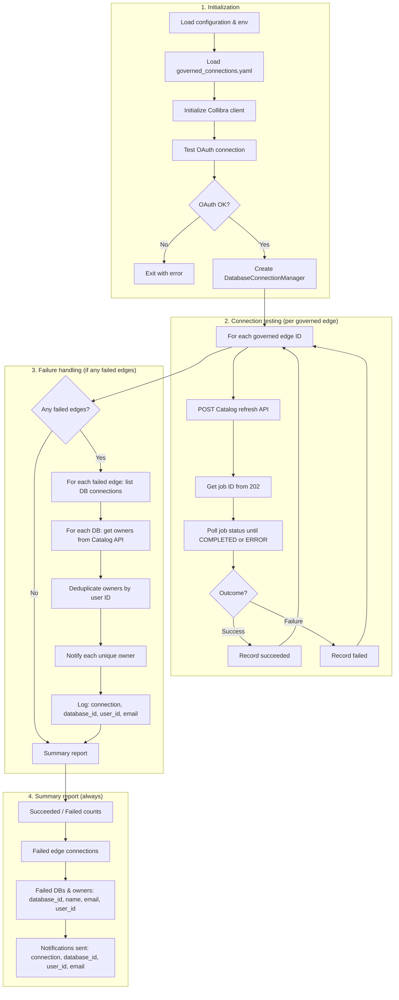

# Collibra Database Connection Testing & Governance Tool

An automated tool for **governing and testing database connections** and **reducing integration and lineage break risk** in Collibra. It governs a defined subset of edge connections (maintained in a version-controlled YAML file), tests those connections, and when failures occur notifies **database owners**—the downstream users who own the affected databases—so broken integrations are caught and actionable. This aligns with Collibra’s accountability model: the tool notifies the same people Collibra holds responsible for those assets (via Owner/Steward responsibilities and the Catalog’s `ownerIds`).

## Overview

Collibra does not provide a built-in way to govern which connections are in scope. This tool fills that gap by letting you declare and maintain a **governed subset** of edge connection IDs, then:

- **Governed Scope**: Operates only on connections defined in a YAML file (edge connection IDs + metadata per connection). Version-control the file to track scope and context over time.
- **Connection Testing**: Refreshes and tests only the governed edge connections; identifies broken integrations and failed connection/lineage jobs.
- **Failure Detection**: Detects databases with failed connection refresh or connection issues
- **Owner Identification**: Retrieves database owner information from Collibra's Catalog Database API
- **Notification**: Notifies database owners when connection tests fail—the same owners Collibra uses for accountability (Catalog `ownerIds`, Owner/Steward responsibilities)—so issues are owned and actionable
- **Reporting**: Summary reports with failed databases, their owners (name, email, **user ID**), and **database ID**; notifications sent list includes connection, **database_id**, **user_id**, and email (owners are deduplicated by user ID so each person is notified once per failed connection)

**Built on a clean, production-ready Python client** for Collibra's REST API with:
- **Clean Architecture**: Separation of concerns with modular design
- **Type Safety**: Full type hints for better IDE support and error detection
- **Error Handling**: Comprehensive exception hierarchy for precise error handling
- **Production Ready**: Retry logic, token management, and robust error handling

## Key Features

### Core Functionality
- ✅ **Governed Subset**: Only tests and monitors connections defined in a YAML file (metadata per edge connection ID). No built-in connection governance in the platform—this file is your single source of truth.
- ✅ **Connection Testing**: Refreshes only governed edge connections; filters database list to those linked to governed edge IDs—reducing risk of touching ungoverned or unowned connections.
- ✅ **Integration & Lineage Risk Reduction**: Catches broken integrations and failed connection/lineage jobs early; notifies owners so issues are owned and fixable.
- ✅ **Job Status Monitoring**: Tracks refresh job status until completion, failure, or timeout
- ✅ **Failure Detection**: Identifies databases with failed connection refresh and captures error details
- ✅ **Owner Information Retrieval**: Fetches database owners from Catalog Database API (`ownerIds` array)
- ✅ **Multiple Owners Support**: Handles databases with multiple owners gracefully
- ✅ **Notification**: Notifies database owners when connection tests fail (same accountability as Collibra: `ownerIds`, Owner/Steward responsibilities); owners deduplicated by user ID (one notification per person per failed database)
- ✅ **Reporting**: Summary report includes succeeded/failed counts, failed databases with **database ID** and owners (name, email, **user ID**), and notifications sent (connection | **database_id** | **user_id** | email)

### Technical Features
- ✅ **OAuth 2.0 Authentication**: Client credentials flow with automatic token management
- ✅ **Token Lifecycle Management**: Automatic token caching and refresh with expiration buffer
- ✅ **Retry Logic**: Built-in retry strategy for transient failures (429, 5xx errors)
- ✅ **Clean Architecture**: Separation of concerns (auth, client, config, catalog, notifications)
- ✅ **Type Hints**: Full type annotations for better IDE support and type checking
- ✅ **Comprehensive Error Handling**: Custom exception hierarchy with detailed error information
- ✅ **Configuration Management**: Support for environment variables and direct initialization
- ✅ **Test Suite**: Comprehensive pytest test suite with integration and unit tests
- ✅ **Pre-commit Hooks**: Automated code quality checks (linting, formatting, type checking)
- ✅ **Script logging**: Colored console output when run in a TTY (INFO=green, WARNING=yellow, ERROR=red); optional file logging via `COLLIBRA_LOG_FILE`

## Governed Connections (YAML)

The tool does **not** operate on all connections in Collibra. It only tests and monitors a **governed subset** that you define in a YAML file. This gives you:

- **Explicit scope**: A clear, auditable list of connections you own and monitor.
- **Metadata per edge**: Name, description, environment, owner team, etc., version-controlled alongside the IDs.
- **Reduced integration risk**: Refresh and automation run only on connections you’ve committed to governing; ungoverned connections are left out of scope.

**Example `governed_connections.yaml`:**

```yaml
# Governed Edge Connections – version-controlled; used for connection testing and filtering

governed_connections:
  "f919489f-2942-418c-a282-4473a1d7492a":
    name: "Production Snowflake"
    description: "Primary Snowflake warehouse for analytics"
    environment: production
    owner_team: "Analytics"

  "a1b2c3d4-5678-90ab-cdef-1234567890ab":
    name: "Staging PostgreSQL"
    description: "Staging DB for integration tests"
    environment: staging
    owner_team: "Platform"
```

The set of governed edge connection IDs is derived from the keys of `governed_connections`. Only those edge connections are refreshed; only databases linked to those edge IDs are tested and monitored. The **connection-testing** script calls the refresh API for each governed edge and **waits for each refresh job to complete** (polls job status until COMPLETED or ERROR) before reporting success or failure. You can extend or change metadata over time and track it in git.

**Why govern a subset?** Without a built-in way to govern connections in the platform, running against “all” connections risks broken integrations, unowned failures, and unclear scope for audits. Defining a governed subset (and version-controlling it) gives you explicit scope, ownership, and a clear story for compliance while reducing integration and lineage break risk.

## Business Process Flow

The connection-testing script (`scripts/refresh_governed_connections.py`) follows this workflow:



**Key process steps:**
1. **Load governed scope**: Read edge connection IDs (and optional metadata) from `governed_connections.yaml`.
2. **Authentication**: OAuth connection test and validation.
3. **For each governed edge**: Call Catalog refresh API (202), extract job ID, poll job status until COMPLETED or ERROR, record success or failure.
4. **For each failed edge**: List database connections under that edge; for each connection with a `database_id`, get owners from Catalog API (`ownerIds`), **deduplicate by user ID** (so the same person is notified once even if listed as Owner and Steward), then **notify** each unique owner (notification includes connection name, database ID, user ID, email).
5. **Summary report**: Succeeded/failed counts; failed edge connections; **failed databases and their owners** (connection name, database ID, edge name, error, owner name, email, **user ID**); **notifications sent** (connection | database_id | user_id | email).

We only govern and test connections (refresh + wait for job); no metadata sync. The end goal is to notify owners of failures and have a clear, auditable summary report including database and user identifiers.

### Collibra accountability

Collibra enforces accountability through **responsibilities** on assets (e.g. Owner, Steward). This tool uses that same model: it notifies the **database owners** returned by the Catalog API (`ownerIds`), so the people who are notified are exactly those Collibra considers responsible for the affected databases. Governance and accountability stay aligned.

## Installation

This project uses [`uv`](https://github.com/astral-sh/uv) for fast Python package management.

### Prerequisites

Install `uv` (if not already installed):
```bash
# macOS/Linux
curl -LsSf https://astral.sh/uv/install.sh | sh

# Windows (PowerShell)
powershell -ExecutionPolicy ByPass -c "irm https://astral.sh/uv/install.ps1 | iex"

# Or using pip
pip install uv
```

### Setup

```bash
# Install dependencies and create virtual environment
uv sync

# Or install with dev dependencies
uv sync --extra dev
```

> **Note**: Dependencies are managed in `pyproject.toml`. If you need a `requirements.txt` file for compatibility, you can generate it with: `uv pip compile pyproject.toml -o requirements.txt`

## Configuration

1. Copy `.env.example` to `.env`:
   ```bash
   cp .env.example .env
   ```

2. Update `.env` with your Collibra credentials:
   ```bash
   # Edit .env file with your actual credentials
   nano .env  # or use your preferred editor
   ```

   The `.env.example` file contains all required environment variables with documentation:
   - **OAuth Credentials**: Required for REST API v2.0 (get from Settings > OAuth Applications)
   - **Basic Auth Credentials**: Required for Catalog Database Registration API (your Collibra username/password)

   **Required Variables:**
   - `COLLIBRA_BASE_URL` - Your Collibra instance URL
   - `COLLIBRA_CLIENT_ID` - OAuth client ID
   - `COLLIBRA_CLIENT_SECRET` - OAuth client secret
   - `COLLIBRA_BASIC_AUTH_USERNAME` - Username for Basic Auth
   - `COLLIBRA_BASIC_AUTH_PASSWORD` - Password for Basic Auth

3. **Governed connections (YAML)**  
   Create or edit `governed_connections.yaml` (or set `COLLIBRA_GOVERNED_CONNECTIONS_CONFIG` to another path). This file defines which edge connection IDs are in scope for testing and monitoring. See [Governed Connections (YAML)](#governed-connections-yaml) above for format and example.

4. **Optional: script logging**  
   Scripts use the `logging` module with colored console output when run in a TTY (INFO=green, WARNING=yellow, ERROR=red). To also write logs to a file, set `COLLIBRA_LOG_FILE` to a path (e.g. `export COLLIBRA_LOG_FILE=./collibra.log`). The file receives plain text (no ANSI codes).

## Usage

### Connection testing (refresh only, wait for completion)

To **test database connections** for your governed set (govern connections only—ensure they do not break):

```bash
python3 scripts/refresh_governed_connections.py
```

This script:
1. Loads governed edge connection IDs from `governed_connections.yaml` (or `COLLIBRA_GOVERNED_CONNECTIONS_CONFIG`)
2. For each governed edge: calls the Catalog refresh API, then **waits for the refresh job to complete** (polls until COMPLETED, ERROR, or timeout)
3. For each **failed** edge: lists database connections, gets owners from the Catalog API (`ownerIds`), **deduplicates by user ID** (one notification per person per failed database), and **notifies** each unique owner (console handler by default; you can plug in Collibra or email handlers). Each notification includes connection name, **database ID**, **user ID**, and email.
4. Prints a **summary report**: succeeded/failed counts; failed edge connections; failed databases with **database ID** and owners (name, email, **user ID**); and notifications sent as `connection | database_id | user_id | email`.

We only govern and test connections; no metadata sync. Logging is colored when run in a TTY; set `COLLIBRA_LOG_FILE` to also write logs to a file.

### List governed database connections

To refresh then list database connections for your governed set (with optional filter by governed edge IDs):

```bash
python3 scripts/test_database_connections_simple.py
```

Uses `governed_connections.yaml`; if present, refreshes only those edge IDs then lists and filters connections. If YAML is missing or empty, skips refresh and lists all connections with a database asset ID.

### Programmatic Usage

If you need to integrate this functionality into your own scripts:

```python
from collibra_client import CollibraClient, CollibraConfig, DatabaseConnectionManager

# Load configuration from environment variables
config = CollibraConfig.from_env()

# Create client
client = CollibraClient(
    base_url=config.base_url,
    client_id=config.client_id,
    client_secret=config.client_secret,
)

# Create database connection manager
db_manager = DatabaseConnectionManager(client=client, use_oauth=True)

# List database connections (optionally filter by edge_connection_id for governed subset)
connections = db_manager.list_database_connections()

# Refresh a governed edge and wait for job completion (see refresh_governed_connections.py)
result = db_manager.refresh_database_connections(edge_connection_id="your-edge-uuid")
job_id = result.get("id")
job_status = client.get_job_status(job_id)
```

### Testing

**Important**: All tests use **real credentials** from your `.env` file. There are no mock tests.

This project uses **pytest** for all testing. Tests are located in the `tests/` directory.

#### Test Setup

Before running tests, ensure you have:
1. Created `.env` file from `.env.example` with your credentials
2. Installed dev dependencies: `uv sync --extra dev`

#### Running Tests

**Run all tests:**
```bash
uv run pytest
```

**Run integration tests only:**
```bash
uv run pytest -m integration -v
```

**Run without coverage (faster, avoids INTERNALERROR):**
```bash
uv run pytest -m integration -v --no-cov
```

**Run specific test file:**
```bash
uv run pytest tests/test_connection.py -v
uv run pytest tests/test_database_connections.py -v
```

**Run specific test:**
```bash
uv run pytest tests/test_connection.py::TestConnection::test_connection_success -v
```

**Run with coverage:**
```bash
uv run pytest --cov=collibra_client --cov-report=term-missing --cov-report=html
```

Coverage reports are generated in `htmlcov/` directory.

#### Test Structure

Tests are organized in the `tests/` directory:
- `conftest.py` - Shared pytest fixtures and configuration
- `test_config.py` - Configuration management tests
- `test_connection.py` - OAuth connection and authentication tests
- `test_database_connections.py` - Database connection management tests

All integration tests are marked with `@pytest.mark.integration` decorator.

#### Rate Limiting

Tests are designed to handle Collibra API rate limits gracefully. If tests hit rate limits (429 errors), they will be **skipped** instead of failing. This prevents false negatives in CI/CD pipelines.

**To avoid rate limits:**
- Run tests individually: `pytest tests/test_connection.py::TestConnection::test_connection_success -v`
- Wait between test runs
- Use session-scoped fixtures (already implemented) to reuse tokens across tests

#### Quick Utility Scripts

For manual testing and quick checks, use the utility scripts in `scripts/` directory:

**Quick OAuth connection test:**
```bash
python3 scripts/test_connection_simple.py
```
This will:
- ✅ Load configuration from `.env`
- ✅ Test OAuth authentication
- ✅ Fetch current user information
- ✅ Verify connection is working

**Connection testing (governed set, wait for completion):**
```bash
python3 scripts/refresh_governed_connections.py
```
Tests only the edge connection IDs in `governed_connections.yaml`: triggers refresh for each and waits for each job to complete. Connection governing only; no metadata sync.

**List governed database connections:**
```bash
python3 scripts/test_database_connections_simple.py
```
Loads `governed_connections.yaml`; refreshes only governed edge IDs then lists and filters connections. If YAML is missing or empty, skips refresh and lists all connections with database asset ID.

See `scripts/README.md` for script details.

#### Test Requirements

All tests require actual credentials in `.env`:
- `COLLIBRA_BASE_URL` - Required
- `COLLIBRA_CLIENT_ID` - Required
- `COLLIBRA_CLIENT_SECRET` - Required

Basic Auth credentials (`COLLIBRA_BASIC_AUTH_USERNAME`, `COLLIBRA_BASIC_AUTH_PASSWORD`) are optional - the database connection manager uses OAuth Bearer token by default.

#### Test Fixtures

The test suite uses pytest fixtures defined in `conftest.py`:
- **Session-scoped fixtures**: Reuse tokens across tests to minimize API calls
- **Client fixtures**: Pre-configured CollibraClient instances
- **Config fixtures**: Configuration loaded from environment variables

#### Writing New Tests

When writing new tests:
1. Mark integration tests with `@pytest.mark.integration`
2. Use fixtures from `conftest.py` for client and configuration
3. Handle rate limits gracefully (tests will skip on 429 errors)
4. Use session-scoped fixtures when possible to reduce API calls

### Direct Initialization

```python
from collibra_client import CollibraClient

client = CollibraClient(
    base_url="https://your-instance.collibra.com",
    client_id="your_client_id",
    client_secret="your_client_secret",
)
```

### Using Dependency Injection

```python
from collibra_client import CollibraClient, CollibraAuthenticator

# Create authenticator separately
authenticator = CollibraAuthenticator(
    base_url="https://your-instance.collibra.com",
    client_id="your_client_id",
    client_secret="your_client_secret",
)

# Inject into client
client = CollibraClient(
    base_url="https://your-instance.collibra.com",
    client_id="your_client_id",
    client_secret="your_client_secret",
    authenticator=authenticator,
)
```

## API Reference

### CollibraClient Methods

The client provides convenience methods for common HTTP operations:

#### `get(endpoint, params=None, headers=None) -> Dict[str, Any]`
Make a GET request to retrieve resources.

**Parameters:**
- `endpoint` (str): API endpoint path (e.g., "/rest/2.0/users")
- `params` (Optional[Dict[str, Any]]): Query parameters
- `headers` (Optional[Dict[str, str]]): Additional HTTP headers

**Returns:** JSON response as dictionary

**Example:**
```python
users = client.get("/rest/2.0/users", params={"limit": 10})
current_user = client.get("/rest/2.0/users/current")
```

#### `post(endpoint, json_data=None, data=None, params=None, headers=None) -> Dict[str, Any]`
Make a POST request to create resources.

**Parameters:**
- `endpoint` (str): API endpoint path
- `json_data` (Optional[Dict[str, Any]]): JSON body data
- `data` (Optional[Union[Dict[str, Any], str]]): Form-encoded body data
- `params` (Optional[Dict[str, Any]]): Query parameters
- `headers` (Optional[Dict[str, str]]): Additional HTTP headers

**Returns:** JSON response as dictionary

**Example:**
```python
new_asset = client.post(
    "/rest/2.0/assets",
    json_data={"name": "My Asset", "domainId": "domain-uuid"}
)
```

#### `put(endpoint, json_data=None, data=None, params=None, headers=None) -> Dict[str, Any]`
Make a PUT request to update resources.

**Parameters:** Same as `post()`

**Returns:** JSON response as dictionary

**Example:**
```python
updated_asset = client.put(
    "/rest/2.0/assets/asset-uuid",
    json_data={"name": "Updated Name"}
)
```

#### `delete(endpoint, params=None, headers=None) -> Dict[str, Any]`
Make a DELETE request to remove resources.

**Parameters:**
- `endpoint` (str): API endpoint path
- `params` (Optional[Dict[str, Any]]): Query parameters
- `headers` (Optional[Dict[str, str]]): Additional HTTP headers

**Returns:** JSON response as dictionary (empty dict for 204 responses)

**Example:**
```python
result = client.delete("/rest/2.0/assets/asset-uuid")
```

#### `test_connection() -> bool`
Test the connection to Collibra API by making a simple authenticated request.

**Returns:** True if connection is successful

**Raises:** `CollibraAPIError` if connection test fails

**Example:**
```python
if client.test_connection():
    print("Connection successful!")
```

## Error Handling

The client raises specific exceptions:

- `CollibraAuthenticationError` - Authentication failures
- `CollibraAPIError` - API request failures
- `CollibraClientError` - Base exception for all client errors

```python
from collibra_client import (
    CollibraClient,
    CollibraAPIError,
    CollibraAuthenticationError,
)

try:
    client = CollibraClient(...)
    data = client.get("/rest/2.0/assets")
except CollibraAuthenticationError as e:
    print(f"Authentication failed: {e}")
except CollibraAPIError as e:
    print(f"API error: {e.status_code} - {e}")
```

## Database Connection Testing

The library supports **testing database connections** and **reducing integration and lineage break risk** by operating on a governed subset of edge connections. It lists/refreshes connections, tests them (refresh and monitor jobs), and notifies owners when failures occur.

### Quick Start

```python
from collibra_client import (
    CollibraClient,
    CollibraConfig,
    DatabaseConnectionManager,
    ConsoleNotificationHandler,
    get_connection_owner,
)

# Note: All imports are available from the main package.
# You can also import directly from scopes if needed:
# from collibra_client.core import CollibraClient, CollibraConfig
# from collibra_client.catalog import DatabaseConnectionManager
# from collibra_client.notifications import ConsoleNotificationHandler

# Load configuration
config = CollibraConfig.from_env()

# Create OAuth client
client = CollibraClient(
    base_url=config.base_url,
    client_id=config.client_id,
    client_secret=config.client_secret,
)

# Create database connection manager (uses OAuth Bearer token by default)
db_manager = DatabaseConnectionManager(
    client=client,
    use_oauth=True,  # Uses OAuth Bearer token (default)
)

# List database connections (optionally filter by edge_connection_id for a governed subset)
connections = db_manager.list_database_connections()
for conn in connections:
    print(f"Connection: {conn.name} (ID: {conn.id})")

# Test a specific connection
result = db_manager.test_database_connection(connections[0].id)
if not result["success"]:
    # Get owner and notify
    owner = get_connection_owner(client, connections[0])
    handler = ConsoleNotificationHandler()
    handler.notify(connections[0], result["message"], owner)
```

### Running the Test Script

A complete script is provided to test all database connections:

```bash
# Set environment variables
export COLLIBRA_BASE_URL="https://your-instance.collibra.com"
export COLLIBRA_CLIENT_ID="your_client_id"
export COLLIBRA_CLIENT_SECRET="your_client_secret"
export COLLIBRA_BASIC_AUTH_USERNAME="your_username"
export COLLIBRA_BASIC_AUTH_PASSWORD="your_password"

# Run connection testing (governed set)
uv run python scripts/refresh_governed_connections.py
```

### Database Connection Manager

The `DatabaseConnectionManager` class provides methods to:

- **`list_database_connections(edge_connection_id=...)`** - List database connections registered in the catalog, optionally filtered by edge connection ID (for governed subset)
- **`refresh_database_connections(edge_connection_id)`** - Refresh connections from the data source for a single Edge connection (required; use governed edge IDs from YAML)
- **`test_database_connection()`** - Test if a connection is still valid
- **`get_database_connection_by_id()`** - Get a specific connection by ID
- **`get_database_asset()`** - Get database asset details (returns `ownerIds` array)

### Owner Information Retrieval

Database owners are retrieved from the Catalog Database API, which returns `ownerIds` as an array. Cataloged databases always have one or several owners.

**Using `get_connection_owner()`:**
```python
from collibra_client import get_connection_owner

owner = get_connection_owner(client, connection)
if owner:
    print(f"Owner: {owner.get('name')}")
    print(f"Email: {owner.get('email')}")
```

**Direct API access:**
```python
db_asset = db_manager.get_database_asset(database_id)
owner_ids = db_asset.get("ownerIds")  # Array of owner IDs
if owner_ids:
    owner_id = owner_ids[0]  # Use first owner
    user = client.get_user(owner_id)
```

### Notification Handlers

Multiple notification handlers are available:

- **`ConsoleNotificationHandler`** - Prints notifications to console (for testing)
- **`CollibraNotificationHandler`** - Sends notifications via Collibra API
- **`EmailNotificationHandler`** - Sends email notifications (placeholder)

You can also create custom handlers by implementing the `NotificationHandler` interface.

## Architecture

The client follows clean architecture principles and design patterns with a modular, scope-based structure:

### Project Structure

```
collibra_client/
├── __init__.py              # Main package exports
├── core/                    # Core functionality
│   ├── __init__.py
│   ├── auth.py              # OAuth 2.0 authentication
│   ├── client.py             # Main HTTP client
│   ├── config.py             # Configuration management
│   └── exceptions.py         # Exception hierarchy
├── catalog/                  # Catalog/Database API functionality
│   ├── __init__.py
│   └── connections.py       # Database connection management
└── notifications/            # Notification system
    ├── __init__.py
    ├── handlers.py           # Notification handlers
    └── owner.py              # Owner information retrieval
```

### Module Structure by Scope

#### **Core Module** (`collibra_client.core`)
Core functionality shared across all features:
- **`auth.py`** - OAuth 2.0 authentication and token lifecycle management
  - `CollibraAuthenticator`: Handles token acquisition, caching, and refresh
  - `TokenInfo`: Data class representing token metadata
- **`client.py`** - Main API client with HTTP methods
  - `CollibraClient`: High-level interface for API interactions
  - Automatic authentication handling
  - Retry logic for transient failures
- **`config.py`** - Configuration management
  - `CollibraConfig`: Configuration class with environment variable support
  - Validation of required configuration values
  - Support for both OAuth and Basic Auth credentials
- **`exceptions.py`** - Custom exception hierarchy
  - `CollibraClientError`: Base exception
  - `CollibraAuthenticationError`: Authentication failures
  - `CollibraAPIError`: API request failures
  - `CollibraTokenError`: Token operation failures

#### **Catalog Module** (`collibra_client.catalog`)
Catalog Database Registration API functionality:
- **`connections.py`** - Database connection management
  - `DatabaseConnection`: Data class representing a database connection
  - `DatabaseConnectionManager`: Manager for testing and refreshing connections
  - Basic Authentication support for Catalog Database Registration API

#### **Notifications Module** (`collibra_client.notifications`)
Notification system for connection failures:
- **`handlers.py`** - Notification handler implementations
  - `NotificationHandler`: Abstract base class for notification handlers
  - `ConsoleNotificationHandler`: Console-based notifications
  - `CollibraNotificationHandler`: Collibra API-based notifications
  - `EmailNotificationHandler`: Email notification handler (placeholder)
- **`owner.py`** - Owner information utilities
  - `get_connection_owner()`: Utility to retrieve connection owners from Collibra assets

### Design Patterns

1. **Dependency Injection**: Authenticator can be injected into the client for testing
2. **Strategy Pattern**: Retry strategy configurable via HTTPAdapter
3. **Factory Pattern**: `CollibraConfig.from_env()` factory method
4. **Facade Pattern**: `CollibraClient` provides a simple interface to complex operations
5. **Single Responsibility**: Each module has a clear, focused responsibility

## Development

### Pre-commit Hooks

This project uses [pre-commit](https://pre-commit.com/) to ensure code quality and consistency. The hooks automatically run checks before each commit.

**Setup:**
```bash
# Install dependencies (pre-commit is included in dev dependencies)
uv sync --extra dev

# Install the git hook scripts
uv run pre-commit install

# (Optional) Run against all files
uv run pre-commit run --all-files
```

**Hooks Included:**
- **Black**: Code formatting (line length: 100)
- **Ruff**: Fast Python linter (replaces flake8, isort, etc.)
- **MyPy**: Static type checking
- **General Checks**: Trailing whitespace, end-of-file fixer, YAML/JSON/TOML validation
- **Security**: Private key detection

**Manual Run:**
```bash
# Run hooks on staged files only
uv run pre-commit run

# Run specific hook
uv run pre-commit run black --all-files
uv run pre-commit run ruff --all-files
uv run pre-commit run mypy --all-files
```

### Adding Dependencies

```bash
# Using uv (recommended)
uv add package-name
uv add --dev package-name

# Using pip
pip install package-name
```

### Code Quality

```bash
# Format code (if black is installed)
black .

# Lint code (if ruff is installed)
ruff check .

# Type checking (if mypy is installed)
mypy collibra_client
```

## Best Practices & Design Principles

### Code Quality

1. **Type Safety**: All functions include type hints for better IDE support and error detection
2. **Documentation**: Comprehensive docstrings following Google-style conventions
3. **Error Handling**: Specific exception types for different failure scenarios
4. **Separation of Concerns**: Each module has a single, well-defined responsibility
5. **Dependency Injection**: Authenticator injection enables easy testing and customization

### Token Management

- **Automatic Caching**: Tokens are cached to minimize API calls
- **Expiration Buffer**: 60-second buffer prevents race conditions
- **Automatic Refresh**: Tokens are refreshed automatically when expired
- **Error Recovery**: Failed authentication triggers automatic retry with new token

### Error Handling

- **Exception Hierarchy**: Clear exception hierarchy for precise error handling
- **Detailed Errors**: Exceptions include status codes and response bodies when available
- **Graceful Degradation**: Network errors are caught and wrapped appropriately

### Testing

- **pytest Framework**: All tests use pytest and are located in `tests/` directory
- **Unit Tests**: Test configuration and isolated components without external dependencies
- **Integration Tests**: Test full client functionality with real Collibra instance (marked with `@pytest.mark.integration`)
- **Test Fixtures**: Reusable fixtures in `conftest.py` for client and configuration setup
- **Rate Limiting Handling**: Tests automatically skip when hitting API rate limits (429 errors) instead of failing
- **Session-Scoped Fixtures**: Tokens are reused across tests to minimize API calls and avoid rate limits
- **Utility Scripts**: Scripts in `scripts/` directory for quick manual testing (not pytest tests)
- **Coverage**: Run tests with coverage reporting: `uv run pytest --cov=collibra_client`

## Troubleshooting

### Common Issues

**Authentication Failures:**
```python
# Check your credentials
try:
    client.test_connection()
except CollibraAuthenticationError as e:
    print(f"Auth failed: {e.status_code} - {e}")
    # Verify COLLIBRA_CLIENT_ID and COLLIBRA_CLIENT_SECRET
```

**Connection Timeouts:**
```python
# Increase timeout
client = CollibraClient(
    base_url=config.base_url,
    client_id=config.client_id,
    client_secret=config.client_secret,
    timeout=60  # Increase from default 30 seconds
)
```

**Token Refresh Issues:**
```python
# Force token refresh
client._authenticator.invalidate_token()
token = client._authenticator.get_access_token(force_refresh=True)
```

**API Errors:**
```python
try:
    result = client.get("/rest/2.0/invalid-endpoint")
except CollibraAPIError as e:
    print(f"Status: {e.status_code}")
    print(f"Error: {e}")
    print(f"Response: {e.response_body}")
```

## License

MIT

