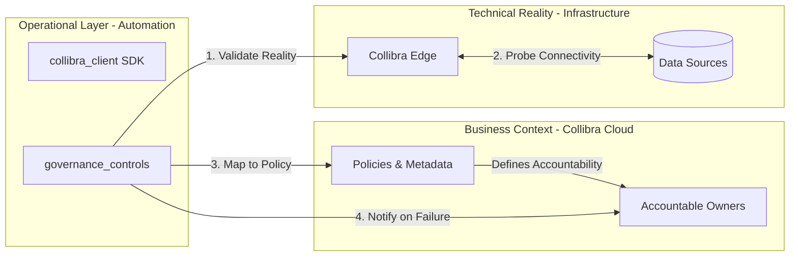

# Collibra Governance Automation Platform

[](https://www.python.org/downloads/)
[](https://github.com/psf/black)
[](LICENSE)

A unified platform for building and running automated governance controls in Collibra. This repository provides a production-ready SDK for Collibra API interactions and a modular framework for governance automation.

**Key Capabilities:**
- OAuth 2.0 authentication with automatic token management
- Catalog Database API integration for connection management
- GraphQL support for Edge operations
- Automated governance controls with owner notifications
- Comprehensive test suite with integration tests

## Table of Contents

- [Architecture Overview](#architecture-overview)
- [The Governance Bridge](#the-governance-bridge)
- [Repository Structure](#repository-structure)
- [Quick Start](#quick-start)
- [Testing](#testing)
- [Development](#development)
- [Troubleshooting](#troubleshooting)
- [FAQ](#faq)
- [Support](#support)
- [Future Roadmap](#future-roadmap)
- [Changelog](#changelog)
- [License](#license)

## Architecture Overview

### 1. Reusable SDK (`collibra_client`)

A production-ready, standalone Python library for any developer wanting to build custom integrations with Collibra.

**Key Features**:
- Standalone library that can be extracted and used in other projects
- OAuth 2.0 authentication with automatic token management
- Support for Catalog Database APIs and GraphQL
- Comprehensive error handling and retry logic

👉 [Read the SDK Documentation](./collibra_client/README.md)

### 2. Governance Controls (`governance_controls`)

A collection of automated, modular controls built on top of the SDK. This is the application layer that enforces policy and operational integrity.

**Key Features**:
- Modular, extensible framework for governance automation
- Pre-built controls for connection testing and validation
- Owner notification system for accountability
- Audit-ready reporting and logging

👉 [Explore Governance Controls](./governance_controls/README.md)

---

## The Governance Bridge

The platform operates as an operational integrity layer, bridging the gap between Collibra's cloud governance (Policies/Owners) and the on-premise/VPC data ecosystem (Reality).


```mermaid
graph LR
    subgraph Cloud["Business Context - Collibra Cloud"]
        P[Policies & Metadata]
        O[Accountable Owners]
    end

    subgraph Automation["Operational Layer - Automation"]
        SDK[collibra_client SDK]
        CTRL[governance_controls]
    end

    subgraph Infrastructure["Technical Reality - Infrastructure"]
        E[Collibra Edge]
        D[(Data Sources)]
    end

    P -->|Defines Accountability| O
    CTRL -->|1. Validate Reality| E
    E <-->|2. Probe Connectivity| D
    CTRL -->|3. Map to Policy| P
    CTRL -->|4. Notify on Failure| O
```

**How it works**: The platform validates technical reality (data source connectivity) and maps failures to governance policies, automatically notifying accountable owners when issues arise.

---

## Repository Structure

```
.
├── collibra_client/              # Reusable Python SDK
│   ├── core/                     # Authentication, HTTP client, config
│   │   ├── auth.py              # OAuth 2.0 token management
│   │   ├── client.py            # HTTP client with retry logic
│   │   ├── config.py            # Environment-based configuration
│   │   └── exceptions.py        # Custom exception hierarchy
│   ├── catalog/                  # Catalog Database API operations
│   │   └── connections.py       # Database connection management
│   └── README.md                # SDK documentation
│
├── governance_controls/          # Automated Controls Framework
│   ├── test_edge_connections/   # Edge Connection Validation Control
│   │   ├── logic/               # Modular business logic
│   │   │   ├── orchestrator.py # Main workflow coordinator
│   │   │   ├── poller.py       # Job status polling
│   │   │   ├── reporter.py     # Report generation
│   │   │   ├── impact_mapper.py # Owner mapping logic
│   │   │   └── heuristic.py    # Connection filtering
│   │   ├── notifications/       # Notification handlers
│   │   ├── governed_connections.yaml # Edge Site configuration
│   │   └── README.md           # Control documentation
│   └── README.md                # Controls framework documentation
│
├── tests/                        # Test suite
│   ├── integration/             # Integration tests
│   │   ├── core/               # SDK core tests
│   │   ├── catalog/            # Catalog API tests
│   │   └── governance_controls/ # Control tests
│   └── conftest.py              # Pytest configuration
│
├── .env.example                  # Environment template
├── pyproject.toml               # Dependencies and tooling
├── CLAUDE.md                    # AI assistant guidance
└── README.md                    # This file
```

---

## Quick Start

### Prerequisites
- Python 3.9+
- [uv](https://github.com/astral-sh/uv) (recommended) or pip.

### Installation

```bash
# Install dependencies using uv (recommended)
uv sync

# Or using pip
pip install -e .
```

### Configuration

```bash
# Copy the example environment file
cp .env.example .env

# Edit .env with your Collibra credentials:
# - COLLIBRA_BASE_URL
# - COLLIBRA_CLIENT_ID
# - COLLIBRA_CLIENT_SECRET
```

### Verify Installation

Test your OAuth connection:
```bash
uv run python governance_controls/test_edge_connections/test_connection_simple.py
```

### Run Your First Control

Execute the Edge Connection Validation control:
```bash
uv run python governance_controls/test_edge_connections/refresh_governed_connections.py
```

---

## Testing

The repository features a unified test suite using `pytest` with support for integration tests.

```bash
# Run all tests
uv run pytest

# Run integration tests only
uv run pytest -m integration

# Run with coverage
uv run pytest --cov=collibra_client --cov-report=term-missing

# Run specific test file
uv run pytest tests/integration/catalog/test_database_connections.py
```

See the [SDK Documentation](./collibra_client/README.md) for detailed testing instructions.

---

## Development

### Code Quality

```bash
# Install pre-commit hooks
pre-commit install

# Run all pre-commit hooks
pre-commit run --all-files

# Format code
black . --line-length=100

# Lint code
ruff check --fix

# Type checking
mypy collibra_client --ignore-missing-imports
```

### Project Structure

- **Line length**: 100 characters (enforced by black and ruff)
- **Python version**: 3.9+ (supports 3.9, 3.10, 3.11, 3.12)
- **Type hints**: Recommended but not strictly enforced
- **Docstrings**: Google-style for public APIs

---

## Future Roadmap

The platform is built for extensibility. Planned enhancements include:

- **Additional Controls**: Lineage verification, metadata completeness, data quality alerts
- **Enhanced SDK**: Expanded REST v2.0 endpoint coverage, improved GraphQL utilities
- **CI/CD Integration**: GitHub Actions workflows for automated governance validation
- **Notification Channels**: Email, Slack, and Teams integration for owner alerts

---

## Troubleshooting

### Common Issues

#### OAuth Authentication Fails

**Problem**: "Authentication failed" or 401 errors

**Solutions**:
1. Verify credentials in `.env` are correct
2. Check that OAuth application is active in Collibra (Settings → OAuth Applications)
3. Ensure `COLLIBRA_BASE_URL` doesn't have trailing slash
4. Clear token cache: `rm -rf ~/.collibra/token_cache/`

#### Connection Tests Fail

**Problem**: "Connection test failed (no error details provided)"

**Explanation**: This is often due to:
- Network connectivity issues between Edge and data source
- Expired or invalid credentials in Collibra connection settings
- Firewall blocking the connection

**Solutions**:
1. Verify the connection works in Collibra UI (Settings → Edge → Connections → Test)
2. Check Edge logs for detailed error messages
3. Verify network connectivity from Edge to data source
4. Update credentials in Collibra connection settings

#### Rate Limiting

**Problem**: 429 Too Many Requests errors

**Solutions**:
1. The SDK automatically retries with exponential backoff
2. Reduce `max_workers` in orchestrator (default: 3)
3. Add delays between operations
4. Contact Collibra support to increase rate limits

#### Import Errors

**Problem**: `ModuleNotFoundError` when running scripts

**Solutions**:
1. Ensure you're using `uv run python` instead of just `python`
2. Verify installation: `uv sync`
3. Check you're in the correct directory
4. Activate virtual environment manually if needed: `source .venv/bin/activate`

---

## FAQ

### General Questions

**Q: Can I use this with Collibra on-premise?**
A: Yes, the SDK supports both Collibra Cloud and on-premise installations. Just set your on-premise URL in `COLLIBRA_BASE_URL`.

**Q: What Collibra version is required?**
A: The SDK is compatible with Collibra 2024.x and later. Some features may require specific versions - check the API documentation.

**Q: Can I use Basic Auth instead of OAuth?**
A: Yes, the Catalog Database API supports both. Set `use_oauth=False` and provide username/password to `DatabaseConnectionManager`.

**Q: Is this officially supported by Collibra?**
A: This is a community project. For official support, contact Collibra directly.

### SDK Questions

**Q: How do I handle pagination?**
A: Use the `limit` and `offset` parameters in list methods:
```python
connections = db_manager.list_database_connections(limit=100, offset=0)
```

**Q: Can I use this in production?**
A: Yes, the SDK is production-ready with comprehensive error handling, retry logic, and testing. However, test thoroughly in your environment first.

**Q: How do I add custom notification handlers?**
A: Extend the `NotificationHandler` abstract class:
```python
class CustomHandler(NotificationHandler):
    def notify(self, connection, error_message, owner_info):
        # Your custom notification logic
        return True
```

### Governance Controls Questions

**Q: How do I add a new governance control?**
A: See the [Governance Controls README](./governance_controls/README.md) for the framework architecture and patterns to follow.

**Q: Can I schedule controls to run automatically?**
A: Yes, use cron (Linux/Mac) or Task Scheduler (Windows):
```bash
# Run daily at 2 AM
0 2 * * * cd /path/to/project && uv run python governance_controls/test_edge_connections/refresh_governed_connections.py
```

**Q: How do I customize the notification messages?**
A: Modify the notification handler or create a custom one. See `governance_controls/test_edge_connections/notifications/handlers.py`.

---

## Support

### Getting Help

- **Documentation**: Start with the [README files](./README.md) in each module
- **Issues**: Report bugs or request features via [GitHub Issues](https://github.com/arnauudG/Collibra-Repository---Automations/issues)
- **Discussions**: Ask questions in [GitHub Discussions](https://github.com/arnauudG/Collibra-Repository---Automations/discussions)
- **Collibra Community**: Visit the [Collibra Community](https://community.collibra.com/) for Collibra-specific questions

### Contributing

We welcome contributions! Please see [CONTRIBUTING.md](./CONTRIBUTING.md) for:
- Development setup instructions
- Coding standards and style guide
- Testing requirements
- Pull request process

### Reporting Security Issues

If you discover a security vulnerability, please **do not** open a public issue. Instead:
1. Email the maintainers privately
2. Include detailed steps to reproduce
3. Wait for confirmation before disclosing publicly

---

## Changelog

See [CHANGELOG.md](./CHANGELOG.md) for detailed version history and release notes.

---

## Acknowledgments

- Built with the [Collibra REST API](https://developer.collibra.com/)
- Inspired by the Collibra community's governance automation needs
- Thanks to all contributors who have helped improve this project

---

## License

This project is licensed under the MIT License. See the [LICENSE](./LICENSE) file for details.
