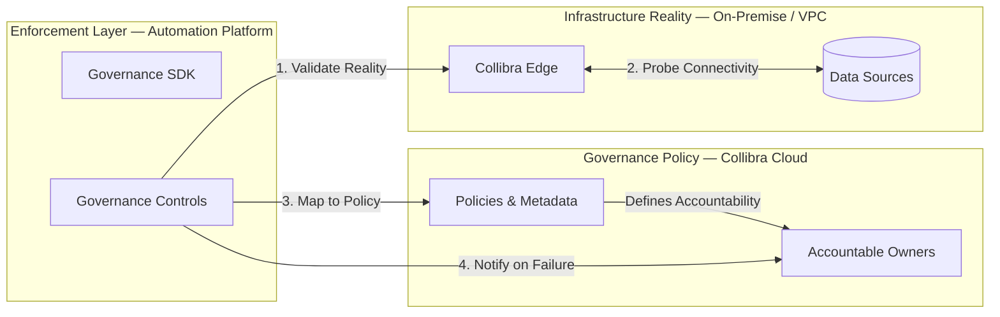

# Collibra Governance Automation Platform

[](https://www.python.org/downloads/)
[](https://github.com/psf/black)
[](LICENSE)

## The Problem

Collibra knows what your data assets are, who owns them, and what policies govern them. But Collibra doesn't know if the infrastructure underneath is still working.

Connections break silently. Credentials expire. Networks change. Edge Sites go offline. When that happens, profiling jobs fail, lineage gaps appear, metadata goes stale — and nobody finds out until an audit reveals that the catalog hasn't reflected reality for weeks.

**This platform closes that gap.** It enforces governance by continuously validating that your data infrastructure matches what Collibra says it should be — and when it doesn't, it maps failures to accountable owners and makes sure the right people know.

## What This Platform Does

- **Enforces connectivity governance**: Validates that every registered data source is actually reachable
- **Catches silent failures early**: Detects broken connections before they cascade into stale metadata, failed profiling, and lineage gaps
- **Maps failures to owners**: Automatically resolves who is accountable for each broken connection using Collibra's ownership model
- **Creates accountability**: Routes alerts to the right stewards so failures get fixed, not ignored
- **Generates audit trails**: Every validation run produces structured, timestamped evidence of what was tested, what passed, what failed, and who was notified

## Table of Contents

- [How Governance Enforcement Works](#how-governance-enforcement-works)
- [The Governance Bridge](#the-governance-bridge)
- [Repository Structure](#repository-structure)
- [Start Enforcing Governance](#start-enforcing-governance)
- [Testing](#testing)
- [Development](#development)
- [Governance Controls Roadmap](#governance-controls-roadmap)
- [Troubleshooting](#troubleshooting)
- [FAQ](#faq)
- [Support](#support)
- [Changelog](#changelog)
- [License](#license)

## How Governance Enforcement Works

The platform has two layers, each with a distinct role in the enforcement chain.

### 1. Governance SDK (`collibra_client`)

The programmatic foundation for all governance automation. This standalone Python library provides authenticated, resilient access to Collibra's REST and GraphQL APIs — the interface through which every governance control interrogates and validates your data platform.

**Governance capabilities**:
- Authenticated access to Collibra's Catalog, Edge, and Core APIs (OAuth 2.0 + Basic Auth)
- GraphQL operations for Edge Site interrogation and connection testing
- Job polling for asynchronous governance operations (refresh, test, sync)
- Resilient HTTP client with automatic retry on transient failures

👉 [SDK Documentation](./collibra_client/README.md)

### 2. Governance Controls (`governance_controls`)

The enforcement layer. Each control is a modular, independently executable automation that validates a specific aspect of your data governance posture. Controls detect issues, analyze business impact, identify accountable owners, and route alerts for remediation.

**Governance capabilities**:
- Modular control framework — each control addresses a specific governance risk
- Owner notification system that maps technical failures to business accountability
- Audit-ready reporting with structured logs and compliance evidence
- Version-controlled governance scope via YAML configuration

👉 [Controls Documentation](./governance_controls/README.md)

---

## The Governance Bridge

The platform operates as an enforcement layer between Collibra's governance metadata (what *should* be true) and your data infrastructure (what *is* true).


```mermaid
graph LR
    subgraph Cloud["Governance Policy — Collibra Cloud"]
        P[Policies & Metadata]
        O[Accountable Owners]
    end

    subgraph Automation["Enforcement Layer — Automation Platform"]
        SDK[Governance SDK]
        CTRL[Governance Controls]
    end

    subgraph Infrastructure["Infrastructure Reality — On-Premise / VPC"]
        E[Collibra Edge]
        D[(Data Sources)]
    end

    P -->|Defines Accountability| O
    CTRL -->|1. Validate Reality| E
    E <-->|2. Probe Connectivity| D
    CTRL -->|3. Map to Policy| P
    CTRL -->|4. Notify on Failure| O
```

**The enforcement loop**: Controls validate infrastructure reality against governance policy. When reality diverges from policy — a connection is broken, a data source is unreachable — the platform maps the failure to the governing policy, identifies the accountable owner, and triggers remediation alerts. This is not monitoring. This is enforcement.

---

## Repository Structure

```
.
├── collibra_client/              # Governance SDK
│   ├── core/                     # Authentication, HTTP client, config
│   │   ├── auth.py              # OAuth 2.0 token management
│   │   ├── client.py            # Resilient HTTP client with retry logic
│   │   ├── config.py            # Environment-based configuration
│   │   └── exceptions.py        # Governance exception hierarchy
│   ├── catalog/                  # Catalog Database API operations
│   │   └── connections.py       # Connection management and validation
│   └── README.md                # SDK documentation
│
├── governance_controls/          # Governance Controls Framework
│   ├── test_edge_connections/   # Connection Validation Control
│   │   ├── logic/               # Control business logic
│   │   │   ├── orchestrator.py # Governance workflow coordinator
│   │   │   ├── poller.py       # Async job status polling
│   │   │   ├── reporter.py     # Audit report generation
│   │   │   ├── impact_mapper.py # Failure-to-owner mapping
│   │   │   └── heuristic.py    # Connection testability analysis
│   │   ├── notifications/       # Owner alert handlers
│   │   ├── governed_connections.yaml # Governed scope definition
│   │   └── README.md           # Control documentation
│   └── README.md                # Controls framework documentation
│
├── tests/                        # Test suite
│   ├── integration/             # Integration tests
│   │   ├── core/               # SDK core tests
│   │   ├── catalog/            # Catalog API tests
│   │   └── governance_controls/ # Control tests
│   └── conftest.py              # Pytest configuration
│
├── .env.example                  # Environment template
├── pyproject.toml               # Dependencies and tooling
├── CLAUDE.md                    # AI assistant guidance
└── README.md                    # This file
```

---

## Start Enforcing Governance

### Prerequisites
- Python 3.9+
- [uv](https://github.com/astral-sh/uv) (recommended) or pip.

### Installation

```bash
# Install dependencies using uv (recommended)
uv sync

# Or using pip
pip install -e .
```

### Configure Credentials

```bash
# Copy the example environment file
cp .env.example .env
```

Edit `.env` with your Collibra credentials. Choose **one** authentication method:

**Option 1: OAuth 2.0 (Recommended for automation)**
```bash
COLLIBRA_BASE_URL=https://your-instance.collibra.com
COLLIBRA_CLIENT_ID=your_client_id
COLLIBRA_CLIENT_SECRET=your_client_secret
```

**Option 2: Basic Authentication**
```bash
COLLIBRA_BASE_URL=https://your-instance.collibra.com
COLLIBRA_USERNAME=your_username
COLLIBRA_PASSWORD=your_password
```

### Verify Connectivity

Test that your credentials can reach Collibra:
```bash
uv run python governance_controls/test_edge_connections/test_connection_simple.py
```

### Run Your First Governance Control

The Connection Validation Control tests data source connectivity and maps failures to owners. Choose the enforcement scope that fits your needs:

```bash
# Targeted enforcement: Test specific connections within an Edge Site
uv run python governance_controls/test_edge_connections/refresh_governed_connections.py \
  --edge-site-id 7d343ace-eecf-4c8c-af2c-3420280e6a2d \
  --connection-id abc123 --connection-id def456

# Direct validation: Test specific connections by ID
uv run python governance_controls/test_edge_connections/refresh_governed_connections.py \
  --connection-id abc123-connection-uuid

# Batch enforcement: Validate all connections under an Edge Site
uv run python governance_controls/test_edge_connections/refresh_governed_connections.py \
  --edge-site-id 7d343ace-eecf-4c8c-af2c-3420280e6a2d

# Governed scope: Validate the full governed perimeter (from YAML config)
uv run python governance_controls/test_edge_connections/refresh_governed_connections.py
```

**Finding IDs**:
- **Connection ID**: Collibra → Settings → Edge → Sites → [Select Site] → Connections (ID in URL)
- **Edge Site ID**: Collibra → Settings → Edge → Sites (ID in URL)

---

## Testing

The repository includes a comprehensive test suite that validates both the SDK and governance controls against a live Collibra instance. All tests require real credentials configured in `.env`.

```bash
# Run all tests (SDK + governance controls)
uv run pytest -v

# Run with coverage
uv run pytest --cov=collibra_client --cov-report=term-missing
```

### Test Categories

| Category | Path | What it Validates |
|----------|------|-------------------|
| SDK Core | `tests/integration/core/` | Config validation, OAuth authentication, client setup |
| Catalog API | `tests/integration/catalog/` | Connection listing, refresh, metadata retrieval |
| Governance Controls | `tests/integration/governance_controls/` | Orchestrator workflows, all enforcement modes |

### Running Specific Tests

```bash
# SDK authentication and configuration
uv run pytest tests/integration/core/ -v

# Connection management API
uv run pytest tests/integration/catalog/test_database_connections.py -v

# Governance orchestrator (all enforcement modes)
uv run pytest tests/integration/governance_controls/test_edge_connections/test_orchestrator.py -v

# Single test
uv run pytest tests/integration/governance_controls/test_edge_connections/test_orchestrator.py::test_orchestrator_test_individual_connections -v
```

### Quick Verification

Before running the full suite, verify authentication:

```bash
uv run python governance_controls/test_edge_connections/test_connection_simple.py
```

See the [SDK Documentation](./collibra_client/README.md) and the [Connection Validation Control](./governance_controls/test_edge_connections/README.md) for detailed testing instructions.

---

## Development

### Code Quality

```bash
# Install pre-commit hooks
pre-commit install

# Run all pre-commit hooks
pre-commit run --all-files

# Format code
black . --line-length=100

# Lint code
ruff check --fix

# Type checking
mypy collibra_client --ignore-missing-imports
```

### Standards

- **Line length**: 100 characters (enforced by black and ruff)
- **Python version**: 3.9+ (supports 3.9, 3.10, 3.11, 3.12)
- **Type hints**: Recommended but not strictly enforced
- **Docstrings**: Google-style for public APIs

---

## Governance Controls Roadmap

The platform is built to host a growing library of automated governance controls. Each control addresses a specific governance risk:

| Planned Control | Governance Risk It Addresses |
|----------------|------------------------------|
| **Lineage Verification** | Automated lineage jobs may silently stop updating, creating invisible gaps in data provenance |
| **Ownership Drift Detection** | Assets accumulate without defined owners, leaving governance gaps when incidents occur |
| **Classification Audit** | Sensitive data assets may lack proper classification labels, creating compliance exposure |
| **Schema Drift Monitoring** | Source schemas change without notice, causing downstream pipeline failures and stale metadata |
| **Metadata Completeness** | Required governance fields (description, owner, domain) are left empty, degrading catalog usefulness |

---

## Troubleshooting

### Common Issues

#### OAuth Authentication Fails

**Problem**: "Authentication failed" or 401 errors

**Solutions**:
1. Verify credentials in `.env` are correct
2. Check that OAuth application is active in Collibra (Settings → OAuth Applications)
3. Ensure `COLLIBRA_BASE_URL` doesn't have trailing slash
4. Clear token cache: `rm -rf ~/.collibra/token_cache/`

#### Connection Tests Fail

**Problem**: "Connection test failed (no error details provided)"

**Explanation**: This is often due to:
- Network connectivity issues between Edge and data source
- Expired or invalid credentials in Collibra connection settings
- Firewall blocking the connection

**Solutions**:
1. Verify the connection works in Collibra UI (Settings → Edge → Connections → Test)
2. Check Edge logs for detailed error messages
3. Verify network connectivity from Edge to data source
4. Update credentials in Collibra connection settings

#### Rate Limiting

**Problem**: 429 Too Many Requests errors

**Solutions**:
1. The SDK automatically retries with exponential backoff
2. Reduce `max_workers` in orchestrator (default: 3)
3. Add delays between operations
4. Contact Collibra support to increase rate limits

#### Import Errors

**Problem**: `ModuleNotFoundError` when running scripts

**Solutions**:
1. Ensure you're using `uv run python` instead of just `python`
2. Verify installation: `uv sync`
3. Check you're in the correct directory
4. Activate virtual environment manually if needed: `source .venv/bin/activate`

---

## FAQ

### General Questions

**Q: Can I use this with Collibra on-premise?**
A: Yes, the SDK supports both Collibra Cloud and on-premise installations. Just set your on-premise URL in `COLLIBRA_BASE_URL`.

**Q: What Collibra version is required?**
A: The SDK is compatible with Collibra 2024.x and later. Some features may require specific versions - check the API documentation.

**Q: Should I use OAuth 2.0 or Basic Authentication?**
A: **OAuth 2.0 is recommended** for governance automation because:
- More secure (tokens expire, can be revoked)
- Better for scheduled and CI/CD-driven enforcement
- Supports all Collibra APIs
- Automatic token refresh

Use **Basic Auth** if:
- You don't have access to create OAuth applications
- Working with legacy Collibra instances
- Need quick setup for testing/development

**Q: Can I switch between OAuth and Basic Auth?**
A: Yes! Just change your `.env` file or pass different credentials to `CollibraClient`. The SDK automatically detects which authentication method to use.

**Q: Is this officially supported by Collibra?**
A: This is a community project. For official support, contact Collibra directly.

### SDK Questions

**Q: How do I handle pagination?**
A: Use the `limit` and `offset` parameters in list methods:
```python
connections = db_manager.list_database_connections(limit=100, offset=0)
```

**Q: Can I use this in production?**
A: Yes, the SDK is production-ready with comprehensive error handling, retry logic, and testing. However, test thoroughly in your environment first.

**Q: How do I add custom notification handlers?**
A: Extend the `NotificationHandler` abstract class:
```python
class CustomHandler(NotificationHandler):
    def notify(self, connection, error_message, owner_info):
        # Your custom notification logic
        return True
```

### Governance Controls Questions

**Q: How do I add a new governance control?**
A: See the [Governance Controls Documentation](./governance_controls/README.md) for the framework architecture and patterns to follow.

**Q: Can I schedule controls to run automatically?**
A: Yes, use cron (Linux/Mac) or Task Scheduler (Windows):
```bash
# Enforce governance daily at 2 AM
0 2 * * * cd /path/to/project && uv run python governance_controls/test_edge_connections/refresh_governed_connections.py
```

**Q: How do I customize the notification messages?**
A: Modify the notification handler or create a custom one. See `governance_controls/test_edge_connections/notifications/handlers.py`.

---

## Support

### Getting Help

- **Documentation**: Start with the [README files](./README.md) in each module
- **Issues**: Report bugs or request features via [GitHub Issues](https://github.com/arnauudG/Collibra-Repository---Automations/issues)
- **Discussions**: Ask questions in [GitHub Discussions](https://github.com/arnauudG/Collibra-Repository---Automations/discussions)
- **Collibra Community**: Visit the [Collibra Community](https://community.collibra.com/) for Collibra-specific questions

### Contributing

We welcome contributions! Please see [CONTRIBUTING.md](./CONTRIBUTING.md) for:
- Development setup instructions
- Coding standards and style guide
- Testing requirements
- Pull request process

### Reporting Security Issues

If you discover a security vulnerability, please **do not** open a public issue. Instead:
1. Email the maintainers privately
2. Include detailed steps to reproduce
3. Wait for confirmation before disclosing publicly

---

## Changelog

See [CHANGELOG.md](./CHANGELOG.md) for detailed version history and release notes.

---

## Acknowledgments

- Built with the [Collibra REST API](https://developer.collibra.com/)
- Inspired by the Collibra community's governance automation needs
- Thanks to all contributors who have helped improve this project

---

## License

This project is licensed under the MIT License. See the [LICENSE](./LICENSE) file for details.
