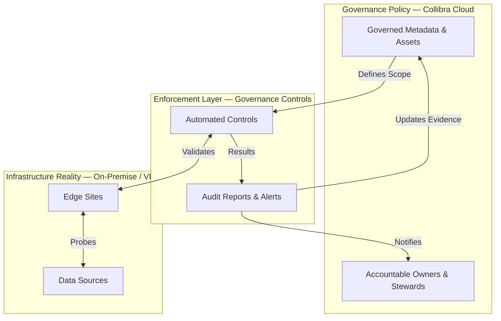

# Governance Controls Framework

Governance without enforcement is just documentation.

Collibra captures your governance policies — who owns what, how data is classified, which connections feed the catalog. But policies alone don't prevent failures, catch drift, or hold anyone accountable when reality diverges from intent. That requires automated enforcement: systematic, repeatable controls that validate the real state of your data infrastructure against what governance says it should be.

This framework provides that enforcement layer.

## Table of Contents

- [Governance Philosophy](#governance-philosophy)
- [The Enforcement Loop](#the-enforcement-loop)
- [Available Controls](#available-controls)
- [Planned Controls](#planned-controls)
- [Design Principles](#design-principles)
- [Usage](#usage)

## Governance Philosophy

Every control in this framework follows the same enforcement pattern:

1. **Detect** — Programmatically validate a specific governance condition (Is this connection reachable? Does this asset have an owner? Is this lineage current?)
2. **Analyze** — When a condition fails, assess the business impact (Which assets are affected? What downstream processes depend on this?)
3. **Map to Owner** — Using Collibra's accountability model, identify who is responsible for remediation
4. **Notify** — Route actionable alerts to the right person — not a generic inbox, but the specific steward or owner accountable for the affected asset
5. **Evidence** — Generate audit-ready logs that prove the control was executed, what it found, and how failures were escalated

This is shift-left governance: catch issues at the infrastructure layer before they cascade into stale metadata, broken lineage, and audit findings.

### The Enforcement Loop



## Available Controls

### 1. Connection Validation Control (`test_edge_connections`)

**Governance risk**: Data source connections can break silently. When they do, profiling fails, lineage gaps appear, and metadata in Collibra stops reflecting reality — often for weeks before anyone notices.

**What this control enforces**: Every governed data source connection is reachable. When a connection fails, the control identifies the impacted database assets, resolves the accountable owners, and sends targeted alerts.

**Enforcement capabilities**:
- Four enforcement modes: targeted, direct, batch, and governed-scope validation
- Parallel connection testing with configurable concurrency
- Heuristic filtering to avoid false positives on non-database connections
- Automatic failure-to-owner mapping via Collibra's Catalog and REST APIs
- Structured audit reports with pass/fail evidence and owner notification records

👉 [View Detailed Documentation](./test_edge_connections/README.md)

## Planned Controls

Each planned control addresses a specific governance risk that organizations face when managing data at scale:

| Control | Governance Risk | What It Will Enforce |
|---------|----------------|---------------------|
| **Lineage Verification** | Automated lineage jobs may silently stop updating, creating invisible gaps in data provenance | Lineage jobs are completing successfully and producing current results |
| **Ownership Drift Detection** | Assets accumulate without defined owners or stewards, leaving governance gaps when incidents occur | Every governed asset has at least one accountable owner assigned |
| **Classification Audit** | Sensitive data assets may lack proper classification labels, creating compliance exposure (GDPR, HIPAA, SOX) | All data assets matching sensitivity criteria have required classification labels applied |
| **Schema Drift Monitoring** | Source schemas change without notice, causing downstream pipeline failures and stale catalog metadata | Source schemas match their registered representation in Collibra; drift triggers alerts to data engineers |
| **Metadata Completeness** | Required governance fields (description, owner, domain, classification) are left empty, degrading catalog value and audit readiness | All governed assets meet minimum metadata completeness thresholds |

## Design Principles

### Modular Architecture
Each control is self-contained with its own:
- Entry point script for independent execution
- Configuration file (YAML) defining the governed scope
- Business logic modules for detection, analysis, and mapping
- Notification handlers for owner alerting

### SDK-Based
All controls leverage the [Governance SDK](../collibra_client/README.md) for:
- Authenticated API access (OAuth 2.0 + Basic Auth)
- GraphQL query execution against Edge Sites
- Job polling and status monitoring for asynchronous operations
- Resilient error handling and automatic retries

### Accountability-Driven
Controls don't just detect failures — they resolve accountability:
- Map technical failures to affected database assets in the Collibra Catalog
- Retrieve owner and steward assignments from asset metadata
- Deduplicate owners across multiple affected assets
- Route targeted alerts via pluggable notification handlers (console, email, Slack)

### Audit-Ready
Every control execution generates compliance evidence:
- Structured logs with timestamps and operation identifiers
- Human-friendly summary reports (pass/fail counts, success rates)
- Owner notification records proving escalation occurred
- Machine-parseable output for integration with compliance dashboards

## Usage

### Running a Control

Each control has its own entry point with multiple enforcement modes. For example, the Connection Validation Control:

```bash
# Targeted enforcement: Validate specific connections within an Edge Site
uv run python governance_controls/test_edge_connections/refresh_governed_connections.py \
  --edge-site-id <edge-site-id> --connection-id <conn-id1> --connection-id <conn-id2>

# Direct validation: Test specific connections by ID
uv run python governance_controls/test_edge_connections/refresh_governed_connections.py \
  --connection-id <conn-id1> --connection-id <conn-id2>

# Batch enforcement: Validate all connections under Edge Sites
uv run python governance_controls/test_edge_connections/refresh_governed_connections.py \
  --edge-site-id <edge-site-id>

# Governed scope: Validate the full governed perimeter from YAML config
uv run python governance_controls/test_edge_connections/refresh_governed_connections.py
```

### Defining the Governed Scope

Controls use YAML configuration files to define which infrastructure falls under governance. This configuration is version-controlled, providing an auditable record of what is governed and who is responsible:

```yaml
# governance_controls/test_edge_connections/governed_connections.yaml
governed_connections:
  "edge-site-id-1":
    name: "Production Edge Site"
    description: "Production Snowflake connections"
    environment: "production"
    owner_team: "Data Platform Team"
```

### Adding New Controls

1. Create a subdirectory under `governance_controls/`
2. Implement the detection, analysis, and mapping logic using the SDK
3. Add a YAML configuration file defining the governed scope
4. Create an entry point script with CLI argument support
5. Document the governance risk, enforcement behavior, and usage in a README

See the [Connection Validation Control](./test_edge_connections/README.md) for a reference implementation.
