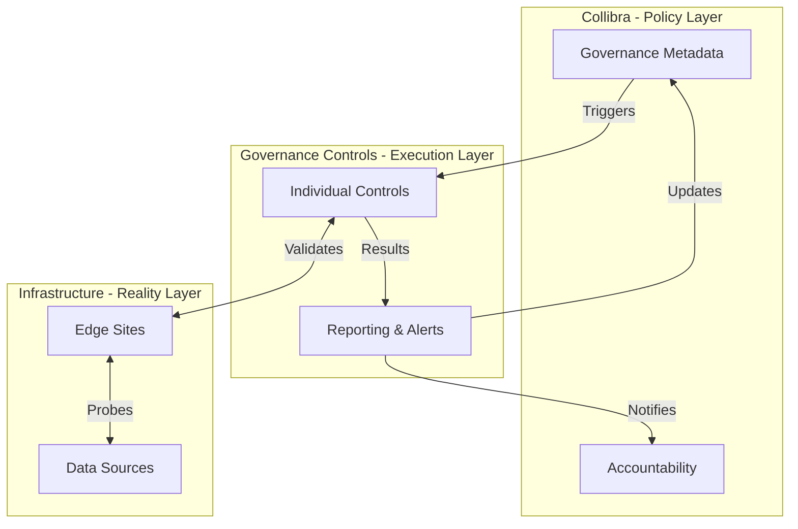

# Governance Controls Framework

The `governance_controls` package provides automated governance controls built on top of the `collibra_client` SDK. Each control is designed to be modular, independently executable, and audit-ready.

## Table of Contents

- [Overview](#overview)
- [Business Value](#business-value)
- [The Automation Bridge](#the-automation-bridge)
- [Available Controls](#available-controls)
- [Planned Controls](#planned-controls)
- [Design Principles](#design-principles)
- [Usage](#usage)

## Overview

This framework bridges the gap between governance metadata in Collibra and the operational reality of your data infrastructure. It enables organizations to:

- **Automate policy enforcement** through programmatic validation
- **Detect failures early** before they impact downstream processes
- **Route alerts to owners** based on Collibra's accountability model
- **Generate audit trails** for compliance and reporting

### The Automation Bridge



## Business Value

### Risk Mitigation & Operational Continuity
Automated controls prevent "governance blind spots" by validating connectivity and metadata quality at the source. This ensures downstream processes (reporting, analytics, audits) are built on a verified foundation.

### Accountability & Ownership
Built on Collibra's accountability model, these controls automatically identify failures and route alerts to the designated owners or stewards. This eliminates confusion about who is responsible for remediation.

### Audit Trail & Compliance
Every control execution generates a structured audit trail with timestamps, results, and owner notifications. This reduces manual effort during compliance reviews and provides real-time visibility into data integrity status.

## Available Controls

### 1. Edge Connection Validation (`test_edge_connections`)

Validates data source connectivity for governed Edge Sites, ensuring that Collibra can successfully connect to registered data sources.

**Key Features**:
- Four execution modes: contextual testing, direct testing, batch testing, governed scope
- Tests connections within Edge Sites or specific connections by ID
- Polls job status with timeout handling
- Maps failures to database assets and owners
- Generates structured reports and notifications

**Business Impact**: Prevents profiling and lineage failures by catching connectivity issues early. Automatically notifies owners when connections break. Enables both targeted troubleshooting and comprehensive governance validation.

👉 [View Detailed Documentation](./test_edge_connections/README.md)

## Planned Controls

The framework is designed to host additional governance controls:

- **Lineage Integrity**: Verify automated lineage jobs are updating correctly
- **Ownership Drift**: Identify assets lacking defined owners or stewards
- **Classification Audit**: Ensure sensitive data assets are properly labeled
- **Schema Drift**: Monitor for unexpected changes in source schemas
- **Metadata Completeness**: Validate required metadata fields are populated

## Design Principles

### Modular Architecture
Each control is self-contained with its own:
- Entry point script
- Configuration file (YAML)
- Business logic modules
- Notification handlers

### SDK-Based
All controls leverage the `collibra_client` SDK for:
- Authenticated API access
- GraphQL query execution
- Job polling and status monitoring
- Error handling and retries

### Accountability-Driven
Controls map technical failures to business owners using Collibra's metadata:
- Identify affected database assets
- Retrieve owner/steward IDs from Catalog API
- Deduplicate and notify via email/console/Slack

### Audit-Ready
Each execution generates:
- Structured logs with timestamps
- Human-friendly summary reports
- Owner notification records
- Pass/fail status for compliance tracking

## Usage

### Running a Control

Each control has its own entry point with multiple execution modes. For example, the Edge Connection Validation control:

```bash
# Contextual testing: Test specific connections within an Edge Site
uv run python governance_controls/test_edge_connections/refresh_governed_connections.py \
  --edge-site-id <edge-site-id> --connection-id <conn-id1> --connection-id <conn-id2>

# Direct testing: Test specific connections by ID
uv run python governance_controls/test_edge_connections/refresh_governed_connections.py \
  --connection-id <conn-id1> --connection-id <conn-id2>

# Batch testing: Test all connections under Edge Sites
uv run python governance_controls/test_edge_connections/refresh_governed_connections.py \
  --edge-site-id <edge-site-id>

# Governed scope: Use YAML configuration file (default)
uv run python governance_controls/test_edge_connections/refresh_governed_connections.py
```

### Configuration

Controls use YAML configuration files to define their scope. Example:

```yaml
# governance_controls/test_edge_connections/governed_connections.yaml
governed_connections:
  "edge-site-id-1":
    name: "Production Edge Site"
    description: "Production Snowflake connections"
    environment: "production"
    owner_team: "Data Platform Team"
```

### Adding New Controls

1. Create a subdirectory under `governance_controls/`
2. Implement control logic using the SDK
3. Add a configuration file (YAML)
4. Create an entry point script
5. Document usage in a README.md

See existing controls for reference implementation patterns.
