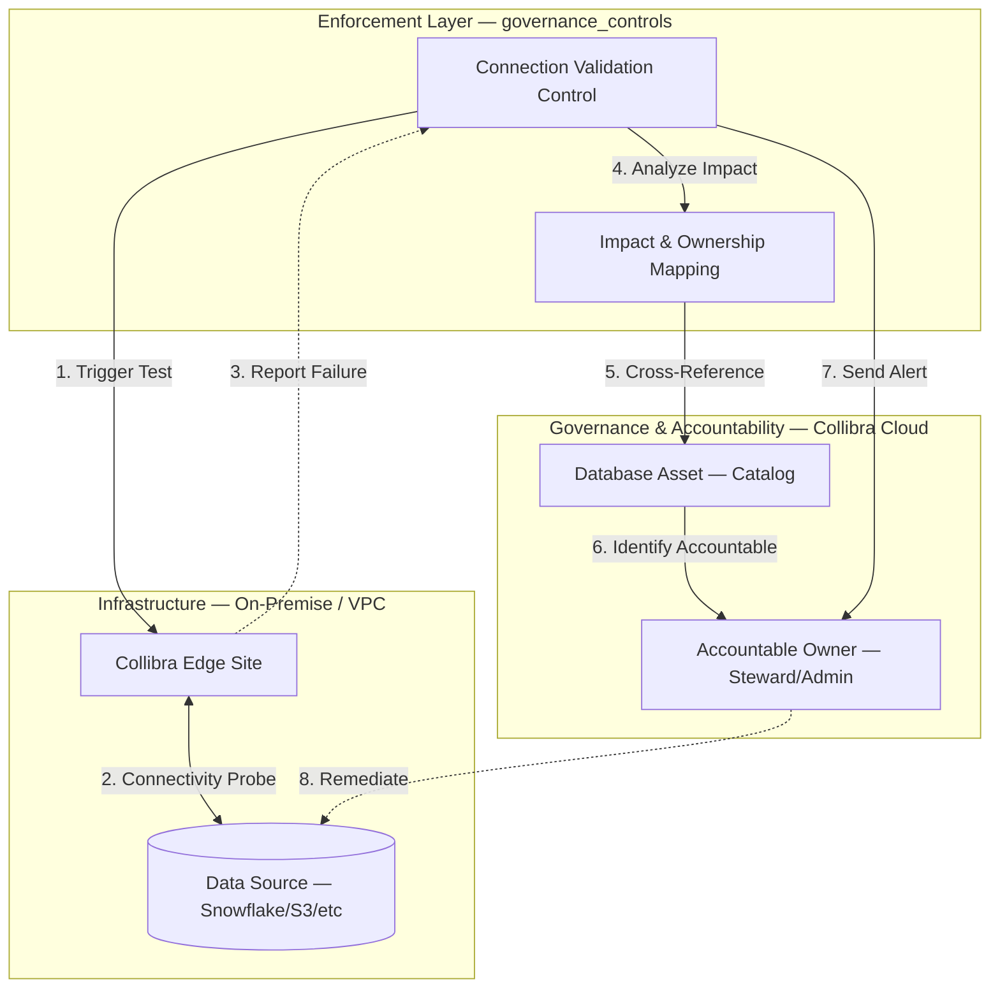

# Connection Validation Control

Data source connections break silently. Credentials expire, firewalls change, Edge Sites go offline. When a connection dies, profiling jobs stop updating, lineage gaps appear, and metadata in Collibra quietly goes stale — often for weeks before an audit reveals the drift.

This control catches those failures before they cascade. It systematically validates every governed data source connection, maps failures to the accountable owners in Collibra, and routes targeted alerts so the right people know and can act.

## Table of Contents

- [Governance Risk](#governance-risk)
- [The Enforcement Loop](#the-enforcement-loop)
- [Architecture](#architecture)
- [Governance Workflows](#governance-workflows)
- [Testing](#testing)
- [Governance Investigation Tools](#governance-investigation-tools)
- [Notification System](#notification-system)
- [Configuration Options](#configuration-options)
- [Troubleshooting](#troubleshooting)

## Governance Risk

### Why This Control Exists

**The risk**: Connection failures are invisible to governance. Collibra continues to display metadata from the last successful profiling run, giving stewards and auditors a false sense of currency. By the time someone notices, the catalog may have been stale for weeks, and the blast radius — broken lineage, outdated classifications, unreliable reports — is already large.

**What this control enforces**: Every governed Edge connection is validated for reachability. Failures trigger immediate impact analysis and owner notification. Every run produces audit evidence of what was tested, what passed, what failed, and who was notified.

### Business Outcomes

| Outcome | How This Control Delivers It |
|---------|------------------------------|
| **Operational integrity** | Catches connectivity failures before they impact profiling, lineage, or downstream analytics |
| **Ownership accountability** | Maps every failed connection to the responsible steward using Collibra's ownership model |
| **Audit compliance** | Generates timestamped evidence of governance enforcement — what was validated and when |
| **Reduced mean time to remediation** | Alerts reach the right owner immediately, not after an audit cycle |

## The Enforcement Loop

This control implements a closed-loop enforcement cycle: detect failure, analyze impact, identify the accountable owner, notify, and generate audit evidence.



### Step-by-Step Enforcement Process

The orchestrator executes this workflow for each governed scope:

1. **Discovery**: Queries the Edge GraphQL API to enumerate all connections under the specified Edge Site(s) or validates specific connection ID(s).

2. **Heuristic Filtering**: Each connection is evaluated for testability by the `ConnectionTestHeuristic`:
   - JDBC connections are always testable (standard database drivers)
   - Blacklisted types are skipped: PowerBI, Azure Lineage, Technical Lineage
   - Generic connections are testable if they have data-source parameters (connection-string, driver-class, host, etc.)
   - Connections with only `authType` configuration (OAuth shells) are skipped

3. **Parallel Validation**: Testable connections are submitted to a `ThreadPoolExecutor`. For each connection:
   - A `connectionTestConnection` GraphQL mutation is sent to the Edge API
   - The mutation returns a `jobId` representing the async test job
   - The `JobPoller` monitors the job via `jobById` GraphQL queries

4. **Job Polling**: The poller watches each job until a terminal state:
   - **Success states**: `COMPLETED`, `SUCCESS`, `SUCCEEDED`, `DONE`
   - **Failure states**: `FAILED`, `ERROR`, `CANCELLED`
   - **Timeout**: Global timeout (default 60s) prevents indefinite waiting
   - **SUBMITTED timeout**: Jobs stuck in SUBMITTED for too long are treated as failures

5. **Impact Mapping**: For each failed connection, the `ImpactMapper`:
   - Queries the Catalog Database API to find all `DatabaseConnection` records linked to the failed Edge connection
   - For each `DatabaseConnection` with a `database_id`, retrieves the database asset
   - Extracts `ownerIds` from the database asset
   - Fetches user details (name, email) for each unique owner via REST v2.0

6. **Owner Notification**: Failed connections trigger targeted alerts:
   - The configured `NotificationHandler` receives the connection, error message, and owner info
   - Console handler logs alerts; Email/Slack handlers can be plugged in

7. **Audit Reporting**: The `GovernanceReporter` generates:
   - Per-connection test results (pass/fail with timing)
   - Aggregate summary (total tested, passed, failed, success rate)
   - Impacted database assets with owner contact details
   - Full audit trail in structured log format

## Architecture

This control uses a modular design where each component has a distinct governance responsibility:

### Core Components

**`GovernanceOrchestrator`** (`logic/orchestrator.py`)
- Governance workflow coordinator with three enforcement entry points:
  - `run()` — Batch enforcement across Edge Sites
  - `test_individual_connections()` — Direct validation of specific connection IDs
  - `test_connections_in_edge_site()` — Targeted enforcement within an Edge Site context
- Manages parallel execution with ThreadPoolExecutor
- Orchestrates the full enforcement loop: discovery → filtering → testing → impact mapping → reporting

**`JobPoller`** (`logic/poller.py`)
- Monitors asynchronous governance job status with configurable timeout
- Automatic fallback: tries REST API first, falls back to GraphQL for Edge jobs
- Handles SUBMITTED state with separate timeout (stale job detection)
- Error categorization: network, authentication, resource not found

**`ImpactMapper`** (`logic/impact_mapper.py`)
- Resolves the governance impact of failed connections
- Maps failed Edge connections to Catalog database assets via the Catalog Database API
- Retrieves owner IDs from database asset metadata
- Deduplicates owners across multiple assets
- Fetches user details (name, email, username) from REST v2.0

**`GovernanceReporter`** (`logic/reporter.py`)
- Generates audit-ready enforcement evidence
- Structured logs with timestamps and visual hierarchy
- Human-friendly summary reports with pass/fail counts and success rate
- Formats impacted asset details and owner notification records

**`ConnectionTestHeuristic`** (`logic/heuristic.py`)
- Determines which connections are meaningful to test
- Filters out non-database connections (PowerBI, Azure Lineage, Technical Lineage)
- JDBC family connections are always testable
- Generic connections are evaluated by inspecting their parameters for data-source keys
- Prevents false positives from non-database sources

**`ConnectionMonitor`** (`connection_monitor.py`)
- Simplified alternative for single-connection validation
- Provides `test_connection()` and `test_and_notify()` convenience methods
- Uses the Catalog Database API for connection discovery

## Governance Workflows

### Finding IDs

- **Edge Site ID**: Navigate to Collibra → Settings → Edge → Sites. The ID is in the URL: `.../settings/edge/sites/<EDGE_SITE_ID>`
- **Connection ID**: Navigate to Collibra → Settings → Edge → Sites → [Select Site] → Connections. The ID is in the URL or can be copied from the connection details page.

### Enforcement Modes

The main script supports four enforcement modes. **Priority order**: `(--edge-site-id + --connection-id)` > `--connection-id` > `--edge-site-id` > `--yaml-config`

#### Mode 1: Targeted Enforcement (Edge Site + Specific Connections)

Validate specific connections within an Edge Site context. The Edge Site metadata enriches logs and notifications while limiting validation to the connections you specify:

```bash
# Validate specific connections within an Edge Site
uv run python governance_controls/test_edge_connections/refresh_governed_connections.py \
  --edge-site-id 7d343ace-eecf-4c8c-af2c-3420280e6a2d \
  --connection-id abc123 \
  --connection-id def456

# With custom settings
uv run python governance_controls/test_edge_connections/refresh_governed_connections.py \
  --edge-site-id 7d343ace-eecf-4c8c-af2c-3420280e6a2d \
  --connection-id abc123 \
  --max-workers 5 \
  --job-timeout 120
```

**When to use**: Investigating a known problematic connection while maintaining Edge Site context for tracking and notifications.

**Note**: Only one `--edge-site-id` can be specified when using `--connection-id`. The script validates (with a warning) if connections belong to the specified Edge Site, but will still test them.

#### Mode 2: Direct Validation (Specific Connections)

Validate specific connections directly without Edge Site context:

```bash
# Validate a single connection
uv run python governance_controls/test_edge_connections/refresh_governed_connections.py \
  --connection-id abc123-connection-uuid

# Validate multiple connections
uv run python governance_controls/test_edge_connections/refresh_governed_connections.py \
  --connection-id abc123 \
  --connection-id def456 \
  --connection-id ghi789
```

**When to use**: Quick validation of specific connections flagged by other systems or during incident response.

#### Mode 3: Batch Enforcement (Full Edge Site)

Validate all connections under specific Edge Sites:

```bash
# Validate all connections under an Edge Site
uv run python governance_controls/test_edge_connections/refresh_governed_connections.py \
  --edge-site-id 7d343ace-eecf-4c8c-af2c-3420280e6a2d

# Validate multiple Edge Sites
uv run python governance_controls/test_edge_connections/refresh_governed_connections.py \
  --edge-site-id 7d343ace-eecf-4c8c-af2c-3420280e6a2d \
  --edge-site-id another-edge-site-id
```

**When to use**: Comprehensive validation of an entire Edge Site — after infrastructure changes, during periodic governance reviews, or as part of environment validation.

#### Mode 4: Governed Scope (YAML Configuration)

Validate the full governed perimeter as defined in version-controlled YAML:

```yaml
governed_connections:
  "7d343ace-eecf-4c8c-af2c-3420280e6a2d":
    name: "Production Edge Site"
    description: "Main production Snowflake connections"
    environment: "production"
    owner_team: "Data Platform Team"

  "another-edge-site-id":
    name: "Development Edge Site"
    description: "Development and testing connections"
    environment: "development"
    owner_team: "Data Engineering Team"
```

Run with YAML config:
```bash
# Use default governed_connections.yaml
uv run python governance_controls/test_edge_connections/refresh_governed_connections.py

# Use custom YAML file
uv run python governance_controls/test_edge_connections/refresh_governed_connections.py \
  --yaml-config /path/to/config.yaml
```

**When to use**: Scheduled, unattended governance enforcement of a fixed perimeter. The YAML file defines what is governed and is version-controlled alongside the control code.

### CLI Options Reference

| Option | Description | Default |
|--------|-------------|---------|
| `--connection-id ID` | Individual connection ID to validate (repeatable) | None |
| `--edge-site-id ID` | Edge Site ID to validate (repeatable; max 1 with `--connection-id`) | None |
| `--yaml-config PATH` | Path to YAML governance scope configuration | `governed_connections.yaml` |
| `--max-workers N` | Maximum parallel workers for connection validation | 3 |
| `--poll-delay N` | Seconds between job status polls | 5 |
| `--job-timeout N` | Maximum seconds to wait for job completion | 60 |

### Expected Output

Example output from a batch enforcement run:
```
2026-03-01 10:15:30 [INFO] Loading configuration...
2026-03-01 10:15:31 [INFO] Connection successful
2026-03-01 10:15:31 [INFO] ================================================================================
2026-03-01 10:15:31 [INFO]   GOVERNANCE CONNECTION TESTING STARTED
2026-03-01 10:15:31 [INFO] ================================================================================
2026-03-01 10:15:32 [INFO] [1/1] Edge Site: Production Edge Site
2026-03-01 10:15:33 [INFO]     SKIPPED: Azure Lineage Connector (Type: tech-lineage - not testable)
2026-03-01 10:15:33 [INFO]     Testing: Snowflake Production DW
2026-03-01 10:15:38 [INFO]     PASSED: Snowflake Production DW
2026-03-01 10:15:38 [INFO]     Testing: Databricks Dev Cluster
2026-03-01 10:15:43 [INFO]     FAILED: Databricks Dev Cluster
2026-03-01 10:15:43 [INFO]       Reason: Authentication/credential issue - Invalid token
2026-03-01 10:15:43 [INFO] ================================================================================
2026-03-01 10:15:43 [INFO]   TEST RESULTS SUMMARY
2026-03-01 10:15:43 [INFO] ================================================================================
2026-03-01 10:15:43 [INFO]   Total Connections Tested: 2
2026-03-01 10:15:43 [INFO]   Passed: 1 connection(s)
2026-03-01 10:15:43 [INFO]   Failed: 1 connection(s)
2026-03-01 10:15:43 [INFO]   Success Rate: 50.0%
```

## Testing

### Prerequisites

Authentication must be configured in `.env` before running any tests.

### Verify Authentication

```bash
# Quick OAuth connection check
uv run python governance_controls/test_edge_connections/test_connection_simple.py
```

### Automated Test Suite

The control has integration tests in `tests/integration/governance_controls/test_edge_connections/`:

```bash
# Run all orchestrator tests
uv run pytest tests/integration/governance_controls/test_edge_connections/test_orchestrator.py -v

# Run a specific test
uv run pytest tests/integration/governance_controls/test_edge_connections/test_orchestrator.py::test_orchestrator_test_individual_connections -v
```

**Available Tests**:

| Test | What it Validates |
|------|-------------------|
| `test_orchestrator_initialization` | Orchestrator components are wired correctly |
| `test_orchestrator_run_smoke` | Full Edge Site enforcement workflow completes without crashing |
| `test_orchestrator_test_individual_connections` | Direct connection validation works end-to-end |
| `test_orchestrator_test_connections_in_edge_site` | Targeted Edge Site + connection validation works |
| `test_orchestrator_test_individual_connections_invalid_id` | Invalid connection IDs are handled gracefully |

### Full Project Test Suite

```bash
# Run all tests (SDK + governance controls)
uv run pytest -v

# Run with coverage report
uv run pytest --cov=collibra_client --cov-report=term-missing
```

## Governance Investigation Tools

When a connection fails validation, these standalone scripts help diagnose the root cause. Each accepts required IDs as CLI arguments — no hardcoded values.

| Script | What it Investigates | Usage |
|--------|---------------------|-------|
| `test_connection_simple.py` | Is the governance service account able to authenticate? | `uv run python governance_controls/test_edge_connections/test_connection_simple.py` |
| `test_database_connections_simple.py` | Which database connections are registered and do they have `database_id` mappings? | `uv run python governance_controls/test_edge_connections/test_database_connections_simple.py` |
| `list_site_connections.py` | What connections exist under an Edge Site and what types are they? | `uv run python governance_controls/test_edge_connections/list_site_connections.py <EDGE_SITE_ID>` |
| `test_connection_detail.py` | What is the full configuration and metadata for a specific connection? | `uv run python governance_controls/test_edge_connections/test_connection_detail.py <CONNECTION_ID>` |
| `debug_job_status.py` | What state is a governance job in, and does REST vs GraphQL agree? | `uv run python governance_controls/test_edge_connections/debug_job_status.py <JOB_ID>` |
| `run_all_tests.sh` | Run all investigation scripts sequentially with rate-limit delays | `bash governance_controls/test_edge_connections/run_all_tests.sh` |

## Notification System

When a connection fails validation, the control executes the full accountability chain:

1. **Identify Impact**: Query Catalog API to find all database assets linked to the failed Edge connection
2. **Retrieve Owners**: Extract owner IDs from each affected database asset
3. **Deduplicate**: Remove duplicate owners across multiple assets
4. **Fetch Details**: Get user information (name, email) for each unique owner via REST v2.0
5. **Send Alerts**: Notify owners via configured handler (console, email, Slack)

### Notification Handlers

**Console Handler** (default): Logs formatted alerts to stdout. Color-coded output for visual scanning. Useful for development and CI/CD pipelines.

**Collibra Handler**: Can create tasks or update assets in Collibra (placeholder implementation, extend for your setup).

**Email Handler**: Sends alerts via SMTP (placeholder implementation, configure with your SMTP server).

**Adding a Custom Handler**: Implement the `NotificationHandler` abstract class:

```python
from governance_controls.test_edge_connections.notifications.handlers import NotificationHandler

class SlackNotificationHandler(NotificationHandler):
    def notify(self, connection, error_message, owner_info=None):
        # Send to Slack webhook
        ...
        return True
```

## Configuration Options

### Orchestrator Settings

```python
orchestrator = GovernanceOrchestrator(
    client=client,
    db_manager=db_manager,
    notification_handler=ConsoleNotificationHandler(),
    max_workers=3,          # Parallel validation threads
    poll_delay=5,           # Seconds between job status checks
    job_timeout=60          # Max seconds to wait for job completion
)
```

### Connection Filtering

The `ConnectionTestHeuristic` automatically skips non-testable connection types to prevent false positives:
- PowerBI connections (BI tools, not data sources)
- Azure Lineage connectors (metadata only)
- Technical Lineage connectors
- OAuth shell connections with no data-source parameters

JDBC family connections are always considered testable.

### Environment Variables

| Variable | Required | Description |
|----------|----------|-------------|
| `COLLIBRA_BASE_URL` | Yes | Collibra instance URL |
| `COLLIBRA_CLIENT_ID` | Yes (OAuth) | OAuth 2.0 client ID |
| `COLLIBRA_CLIENT_SECRET` | Yes (OAuth) | OAuth 2.0 client secret |
| `COLLIBRA_USERNAME` | Yes (Basic) | Username for Basic Auth |
| `COLLIBRA_PASSWORD` | Yes (Basic) | Password for Basic Auth |
| `COLLIBRA_TIMEOUT` | No | Request timeout in seconds (default: 30) |
| `COLLIBRA_LOG_FILE` | No | Path to log file for persistent audit logging |
| `COLLIBRA_GOVERNED_CONNECTIONS_CONFIG` | No | Override path to YAML governance scope |

## Troubleshooting

### Common Issues

**Authentication fails (401)**:
- Verify credentials in `.env` are correct
- Check that the OAuth application has the required scopes in Collibra
- Run `test_connection_simple.py` to isolate authentication issues

**Rate limiting (429)**:
- Reduce `--max-workers` to lower parallel request volume
- Increase `--poll-delay` to space out polling requests
- Collibra enforces per-client rate limits; wait between runs

**Jobs stuck in SUBMITTED**:
- The Edge Site agent may be offline or overloaded
- Check Edge Site status in Collibra Settings → Edge → Sites
- The poller has a separate SUBMITTED timeout (default: 60s) to detect stale jobs

**All connections skipped**:
- The heuristic may be filtering out all connections
- Use `list_site_connections.py <EDGE_SITE_ID>` to inspect connection types
- Review the heuristic blacklist in `logic/heuristic.py`

**No impacted assets found**:
- Connections must be linked to Database assets in the Collibra Catalog
- Run `test_database_connections_simple.py` to check if connections have `database_id` values
- Ensure a Catalog refresh has been run for the Edge Site
